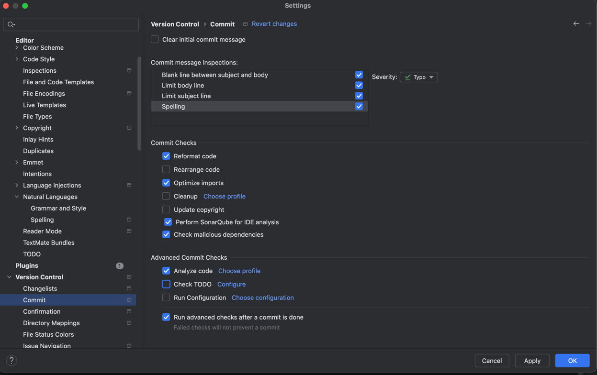

# Git 커밋 메시지 템플릿 설정 가이드

## 템플릿 적용 방법

### 1. 로컬 저장소에만 적용 (권장)

프로젝트 루트 디렉토리에서 실행:

```bash
git config commit.template .gitmessage.txt
```

### 2. 전역 설정 (모든 Git 프로젝트에 적용)

```bash
# 먼저 템플릿 파일을 홈 디렉토리로 복사
cp .gitmessage.txt ~/.gitmessage.txt

# 전역 설정 적용
git config --global commit.template ~/.gitmessage.txt
```

### 3. 설정 확인

```bash
# 로컬 설정 확인
git config commit.template

# 전역 설정 확인
git config --global commit.template
```

## 사용 방법

### 커밋 메시지 작성 시

```bash
git add .
git commit
```

텍스트 에디터가 열리면서 템플릿이 자동으로 표시됩니다.
(`git commit -m "..."` 사용 시에는 템플릿이 표시되지 않음)

### 주석 처리 원리

**중요:** `#`로 시작하는 모든 줄은 Git이 자동으로 제거합니다.

```
에디터에서 작성:
Feat: 회원가입 기능 추가

회원가입 API 구현

# ============================================
# 커밋 메시지는 위에 작성 (아래는 참고용)
# ============================================
# Feat: 새로운 기능 추가
# Fix: 버그 수정

실제 커밋 결과:
Feat: 회원가입 기능 추가

회원가입 API 구현
```

**테스트 방법:**

```bash
# 1. 테스트 파일 생성
echo "실제 메시지
# 이 줄은 제거됩니다" > test_msg.txt

# 2. Git이 처리하는 방식 확인
grep -v '^#' test_msg.txt

# 출력: 실제 메시지
```

**주석 문자 변경 (선택사항):**

```bash
# 기본값 확인
git config core.commentChar

# 다른 문자로 변경 (예: ;)
git config core.commentChar ";"
```

### 커밋 메시지 예시

#### 예시 1: 기본 사용

```
Feat: 회원 로그인 API 추가

JWT 기반 인증 방식으로 로그인 기능 구현
- Spring Security 설정 추가
- JWT 토큰 생성 및 검증 로직 구현
- 로그인 API 엔드포인트 추가

Resolves: #123
```

#### 예시 2: 버그 수정

```
Fix: 회원가입 시 이메일 중복 검사 오류 수정

이메일 중복 검사 로직에서 대소문자 구분 문제 해결
- 이메일을 소문자로 변환하여 비교하도록 수정
- 관련 테스트 케이스 추가

Resolves: #456
```

#### 예시 3: 긴급 수정

```
!HOTFIX: 결제 모듈 NPE 긴급 수정

결제 금액이 null일 때 발생하는 NPE 수정
- null 체크 로직 추가
- 기본값 0으로 설정

Resolves: #789
```

---

## IDE별 설정

### IntelliJ IDEA

**기본 설정:**

1. **Settings** → **Version Control** → **Commit**
2. **Commit message** 섹션에서 템플릿 관련 설정 확인



**AI 커밋 메시지 생성 (JetBrains AI Assistant):**

1. AI Assistant 플러그인 설치
2. Commit 창에서 "Generate Commit Message" 버튼 사용
3. AI가 `.github/COMMIT_CONVENTION.md`를 참고하여 메시지 생성

**프롬프트 커스터마이징:**

```
Settings → Tools → AI Assistant → Custom Instructions

변경사항을 분석하여 다음 형식으로 커밋 메시지 작성:
<Type>: <제목>

타입은 Feat, Fix, Refactor, Test, Docs, Chore 중 선택
제목은 한글 50자 이내, 명령조
```

### VS Code

**확장 설치:**

1. `Conventional Commits` - 커밋 타입 자동완성
2. `GitHub Copilot` - AI 커밋 메시지 생성
3. `GitLens` - Git 기능 강화

**설정 (.vscode/settings.json):**

```json
{
  "git.inputValidationLength": 50,
  "conventionalCommits.autoCommit": false,
  "conventionalCommits.scopes": [
    "member",
    "product",
    "order"
  ]
}
```

**Copilot으로 커밋 메시지 생성:**

1. Source Control 탭 열기
2. 커밋 메시지 입력란에서 Copilot 아이콘 클릭
3. AI가 변경사항 분석하여 메시지 제안

### Cursor / Windsurf

내장 AI가 자동으로 커밋 메시지 생성:

1. Cmd/Ctrl + K → "Generate commit message"
2. AI가 `.github/COMMIT_CONVENTION.md` 기반으로 생성

## 템플릿 비활성화

```bash
# 로컬 설정 제거
git config --unset commit.template

# 전역 설정 제거
git config --global --unset commit.template
```

## 팀 규칙

- **타입**: 영문 대문자로 시작 (Feat, Fix, Docs 등)
- **제목**: 한글, 50자 이내, 명령조
- **본문**: 한글, 무엇을 왜 변경했는지 설명
- **이슈 연결**: `Resolves: #이슈번호` 형식 사용

## 주의사항

1. `-m` 옵션 사용 시 템플릿이 적용되지 않음
2. 템플릿의 주석(#)은 커밋 메시지에 포함되지 않음
3. 빈 줄은 제목과 본문을 구분하는데 중요함
