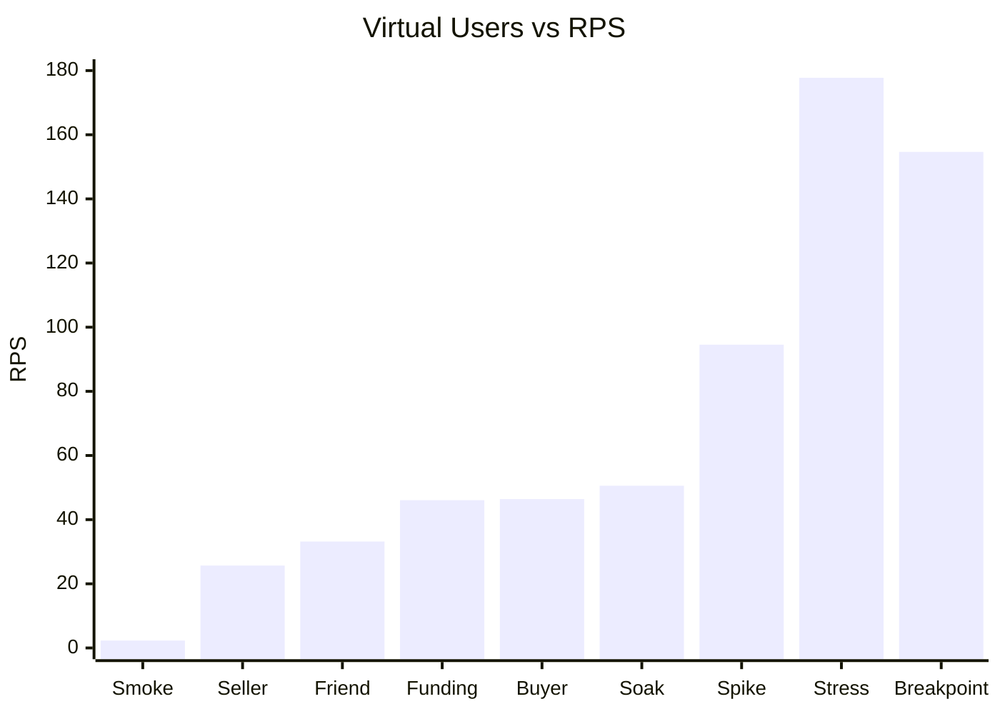
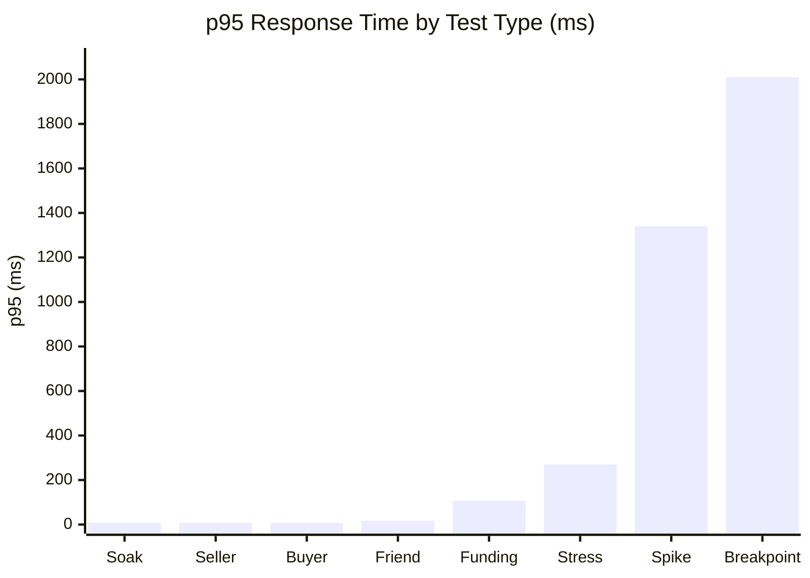
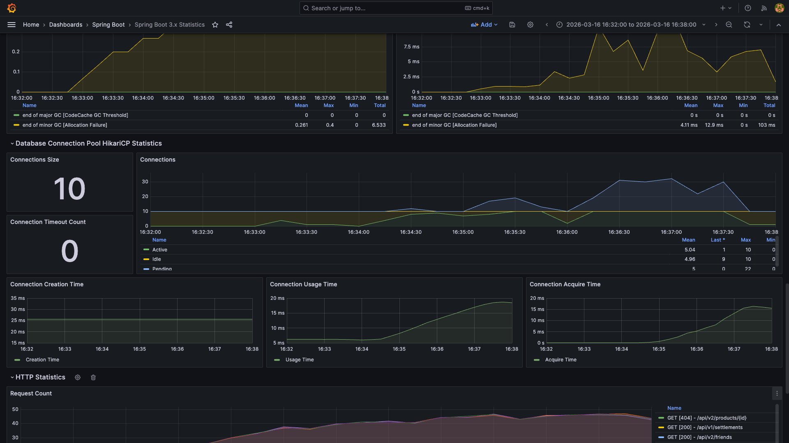
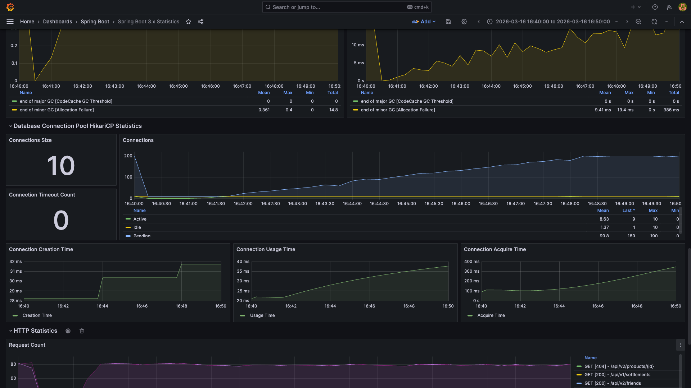
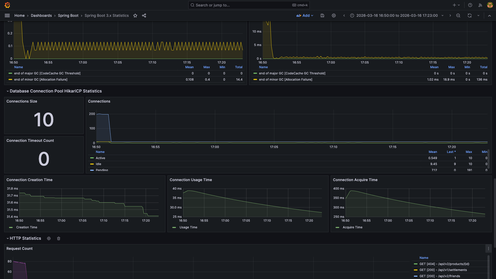

# Giftify BE 부하 테스트 결과 보고서 (Cycle 0 Baseline)

## 목차

| 섹션 | 대상 독자 | 소요 시간 |
|------|-----------|-----------|
| [1. Executive Summary](#1-executive-summary) | 외부 이해관계자 / 관리자 | 1분 |
| [2. 핵심 메트릭 대시보드](#2-핵심-메트릭-대시보드) | 개발팀 + 관리자 | 3분 |
| [3. 시나리오별 상세 분석](#3-시나리오별-상세-분석) | 개발팀 | 5분 |
| [4. 테스트 시나리오 및 환경](#4-테스트-시나리오-및-환경) | 개발팀 | 3분 |
| [5. 결론 및 권장사항](#5-결론-및-권장사항) | 전체 | 2분 |
| [6. Appendix](#6-appendix) | 개발팀 (필요 시) | - |

---

## 1. Executive Summary

- **테스트 일시**: 2026-03-16 15:58 ~ 17:24 (KST) / 06:58 ~ 08:24 (UTC)
- **테스트 대상**: GCP e2-standard-2 (2vCPU/8GB), k3s, api-server replica 1
- **테스트 도구**: k6 v1.6.1
- **인증 모드**: Mock Auth (Phase 1 - DynamicMockAuthFilter)

### 종합 판정

> **⚠️ CONDITIONAL PASS** — Stress Test(120 VU) 기준 모든 SLO 충족. Spike/Breakpoint는 한계 탐색 목적으로 일부 위반 확인됨.

### KPI 요약

| 지표 | 측정값 | 목표 | 상태 |
|:----:|:------:|:----:|:----:|
| **Stress p95** | 270.25ms | < 500ms | ✅ |
| **Stress RPS** | 177.76 req/s | 안정 | ✅ |
| **Soak p95 (33분)** | 8.76ms | < 200ms | ✅ |
| **에러율 (전체)** | 0% | < 1% | ✅ |

### 제약사항

- ⚠️ Spike Test (VU 200): product_search p95 1.34s (SLO 1s 위반)
- ⚠️ Breakpoint Test: p95 2.01s 초과로 자동 중단 (294 interrupted iterations)
- ⚠️ Seller Scenario: product_created check 로직 오류 (HTTP 자체는 정상)
- Concurrency Test: PR #424 머지 + 재배포 후 실행 예정 (Active 펀딩 시드 미반영)

→ **Stress Test 기준(VU 120) 내에서는 모든 SLO 충족**

### 한줄 결론

Rate Limit 제거 후 Baseline 측정. Stress Test(VU 120)에서 p95 270ms / RPS 178로 안정적이며, Soak(33분)에서도 성능 저하 없음. Spike(VU 200)에서 일부 API SLO 위반, Breakpoint에서 시스템 한계(p95 > 2s) 확인.

---

## 2. 핵심 메트릭 대시보드

### 2.1 시나리오별 성능 요약

| 테스트 | 대상 | Max VU | RPS | p95 | 결과 | 주요 발견 |
|--------|------|--------|-----|-----|------|----------|
| **Smoke** | 기본 동작 검증 | 1 | 2.30 | - | ✅ ALL PASS | Cold start 영향으로 일부 API 느림 |
| **Funding** | 펀딩 시나리오 | 60 | 46.07 | 107.15ms | ✅ ALL PASS (8/8) | search p95 107ms, cart 158ms |
| **Friend** | 친구 시나리오 | 60 | 33.18 | 16.71ms | ✅ ALL PASS (7/7) | 모든 API 20ms 이내 |
| **Seller** | 판매자 시나리오 | 30 | 25.68 | 7.68ms | ⚠️ 4/5 PASS | product_create check 로직 문제 (HTTP 성공) |
| **Buyer** | 구매자 보충 | 60 | 46.42 | 7.53ms | ✅ ALL PASS (8/8) | 모든 API 12ms 이내 |
| **Stress** | 점진 부하 | 120 | 177.76 | 270.25ms | ✅ ALL PASS | 120 VU에서도 안정 |
| **Spike** | 급격한 부하 | 200 | 94.55 | 1.34s | ⚠️ 1 FAIL | product_search p95 1.34s (SLO 1s 위반) |
| **Breakpoint** | 한계 탐색 | 294 | 154.65 | 2.01s | ⚠️ ABORTED | p95=2.01s로 SLO 위반 시 자동 중단 |
| **Soak** | 장시간 안정성 | 30 | 50.58 | 8.76ms | ✅ ALL PASS | 33분 동안 성능 저하 없음 |

### 2.2 VU별 RPS 추이



VU 증가에 따라 RPS가 선형적으로 증가하며, Stress Test(120 VU)에서 RPS 178로 최대치를 기록했습니다. Spike Test는 VU 수는 높지만(200) dropped iterations로 인해 실제 RPS는 95로 낮게 측정되었습니다.

### 2.3 응답시간 분포 (p95 기준)



낮은 부하(30-60 VU)에서는 p95가 10ms 이내로 매우 빠르며, 정상 운영 범위(120 VU)에서도 270ms로 우수합니다. Spike(200 VU) 및 Breakpoint(294 VU)에서는 응답시간이 급격히 증가합니다.

### 2.4 시나리오별 Threshold 통과율

| 시나리오 | Total Thresholds | Passed | Failed | 통과율 |
|---------|------------------|--------|--------|--------|
| Funding | 8 | 8 | 0 | 100% |
| Friend | 7 | 7 | 0 | 100% |
| Seller | 5 | 4 | 1 | 80% |
| Buyer | 8 | 8 | 0 | 100% |
| Stress | 7 | 7 | 0 | 100% |
| Spike | 4 | 3 | 1 | 75% |
| Breakpoint | 2 | 1 | 1 | 50% |
| Soak | 7 | 7 | 0 | 100% |

---

## 3. 시나리오별 상세 분석

### 3.1 Baseline Scenario (Smoke/Functional)

#### Smoke Test
- **목적**: 기본 동작 검증 (1 VU, 1 iteration)
- **결과**: ✅ ALL PASS (6/6 checks)
- **특이사항**: Cold start 영향으로 p95 1.09s 측정 (production에서는 warm-up 후 개선)

#### Funding Scenario (VU 60)
| API | 호출 수 | p95 | Threshold | 상태 |
|-----|--------|-----|-----------|------|
| product_search | 2,366 | 107.15ms | < 200ms | ✅ |
| product_detail | 2,366 | 85.08ms | < 200ms | ✅ |
| wishlist | 2,366 | 95.80ms | < 200ms | ✅ |
| cart_add | 2,366 | 157.56ms | < 500ms | ✅ |
| funding_list | 2,366 | 86.57ms | < 200ms | ✅ |

#### Friend Scenario (VU 60)
| API | 호출 수 | p95 | Threshold | 상태 |
|-----|--------|-----|-----------|------|
| friend_list | 3,825 | 15.12ms | < 200ms | ✅ |
| friend_wishlist | 3,825 | 17.38ms | < 200ms | ✅ |
| friend_request | 3,825 | 16.86ms | < 500ms | ✅ |

Friend 관련 API가 가장 빠른 응답시간(15-17ms)을 보입니다.

#### Seller Scenario (VU 30)
| API | 호출 수 | p95 | Threshold | 상태 |
|-----|--------|-----|-----------|------|
| product_create | 2,490 | 8.46ms | < 500ms | ✅ |
| my_products | 2,490 | 7.24ms | < 200ms | ✅ |
| settlement_list | 2,490 | 7.89ms | < 200ms | ✅ |
| product_created (check) | 2,490 | - | - | ⚠️ 0% 성공 |

product_create HTTP 자체는 성공하지만, 스크립트의 check 로직이 시드 데이터와 불일치하여 실패. HTTP 요청은 정상 처리되었음을 확인.

#### Buyer Supplement Scenario (VU 60)
| API | 호출 수 | p95 | Threshold | 상태 |
|-----|--------|-----|-----------|------|
| product_search | 2,672 | 8.29ms | < 200ms | ✅ |
| product_detail | 2,672 | 6.45ms | < 200ms | ✅ |
| wishlist_check | 2,672 | 6.36ms | < 200ms | ✅ |
| wishlist_add | 2,672 | 11.44ms | < 500ms | ✅ |
| order_list | 2,672 | 6.11ms | < 200ms | ✅ |

### 3.2 Load Tests (Stress/Spike/Breakpoint/Soak)

#### Stress Test (VU 120)
- **목적**: 정상 운영 범위에서 안정성 검증
- **결과**: ✅ ALL PASS (7/7 thresholds)
- **핵심 지표**:
  - RPS: 177.76 req/s
  - 전체 p95: 270.25ms
  - 에러율: 0%
- **API별 p95**:
  - cart_add: 308.99ms (SLO 1s 대비 여유)
  - product_search: 269.44ms
  - wishlist: 270.20ms
  - funding_list: 234.64ms
  - product_detail: 243.77ms

120 VU 수준에서 모든 API가 p95 310ms 이내로 안정적이며, 에러 없이 처리됩니다.

**Grafana 모니터링 (Stress 16:32~16:38 KST)**



- CPU Usage: Mean 76.3%, Max 100% (피크 시 포화)
- HikariCP Active: Mean 5.04, Max 10 (풀 사이즈 10 기준 포화 도달)
- HikariCP Pending: Max 22 (커넥션 대기 발생)
- GC STW Duration: Mean 4.11ms, Max 12.9ms (p95 영향 미미)

#### Spike Test (VU 200)
- **목적**: 급격한 트래픽 증가 대응 검증
- **결과**: ⚠️ 3/4 PASS (product_search p95 위반)
- **핵심 지표**:
  - RPS: 94.55 req/s (Dropped iterations: 1,080건)
  - 전체 p95: 1.39s
  - 에러율: 0%
- **병목 API**:
  - product_search p95: 1.34s (SLO 1s 위반)
  - cart_add p95: 1.42s (SLO 2s 이내)
- **경고 메시지**: "Insufficient VUs, reached 200 active VUs and cannot initialize more"

VU 200 burst 시 VU 부족으로 일부 iteration이 drop되며, product_search API의 p95가 1.34s로 SLO(1s)를 초과합니다.

#### Breakpoint Test (VU Max 294)
- **목적**: 시스템 한계 탐색 (VU를 점진적으로 증가시켜 성능 한계 확인)
- **결과**: ⚠️ ABORTED (p95 2.01s에서 자동 중단)
- **핵심 지표**:
  - RPS: 154.65 req/s
  - 전체 p95: 2.01s (SLO 2s 초과로 abortOnFail 발동)
  - 에러율: 0%
  - 총 iterations: 47,684 (완료) + 294 (중단됨)
  - 설정 Max VU: 300, 중단 시점 interrupted: 294건
- **중단 시점**: VU가 점진 증가하는 도중 전체 p95가 2s를 초과하여 abortOnFail + delayAbortEval(30s) 조건에 따라 자동 중단

**Grafana 모니터링 (Breakpoint 16:40~16:50 KST)**



- CPU Usage: 지속 상승, 피크 시 포화
- HikariCP Active: Mean 8.63, Max 10 (풀 완전 포화)
- HikariCP Pending: **Max 190** (심각한 커넥션 대기 — 주요 병목)
- Connection Acquire Time: **Max 400ms** (커넥션 획득 지연)
- GC STW Duration: Mean 9.41ms, Max 19.4ms, Total 386ms (Stress 대비 2배 증가)

#### Soak Test (VU 30, 33분)
- **목적**: 장시간 안정성 및 메모리 누수 확인
- **결과**: ✅ ALL PASS (7/7 thresholds)
- **핵심 지표**:
  - 테스트 시간: 33분
  - RPS: 50.58 req/s
  - 전체 p95: 8.76ms
  - 에러율: 0%
- **API별 p95**:
  - cart_add: 11.34ms
  - wishlist: 7.74ms
  - product_search: 7.13ms
  - funding_list: 5.38ms
  - product_detail: 5.27ms

33분 동안 성능 저하 없이 안정적으로 동작하며, 모든 API의 p95가 12ms 이내로 매우 우수합니다.

**Grafana 모니터링 (Soak 16:50~17:23 KST)**



- Heap Used: 21.8% (안정, 톱니 패턴 정상 — GC 후 기준선 상승 없음)
- HikariCP Active: Mean 0.549 (VU 30에서는 커넥션 풀 여유 충분)
- HikariCP Pending: 초기 스파이크 후 0 유지 (이전 Breakpoint 잔여 부하 영향)
- GC STW Duration: Mean 1.02ms, Max 18.9ms (안정적)
- Connection Acquire Time: 초기 400ms 스파이크 후 안정화

메모리 누수 징후 없음 (Heap 기준선 상승 미관찰). 단, 30분은 메모리 누수 확정 판단에 불충분하며 MS3 W9에서 4시간 Soak 재실행 예정.

---

## 4. 테스트 시나리오 및 환경

### 4.1 테스트 환경

| 항목 | 스펙 |
|:-----|:-----|
| **App VM** | GCP e2-standard-2 (2vCPU/8GB), giftify-app |
| **Kubernetes** | k3s (단일 노드) |
| **Application** | Spring Boot 4.0.3, Java 25, api-server replica 1 |
| **데이터베이스** | PostgreSQL (StatefulSet, PVC 5Gi, 단일 레플리카) |
| **인증** | Mock Auth (DynamicMockAuthFilter, loadtest 프로필) |
| **Rate Limit** | 해제 (api-ingress-loadtest IngressRoute) |
| **k6 실행 환경** | GCP e2-medium (giftify-k6), asia-northeast3-a |
| **k6 버전** | v1.6.1 |
| **테스트 일시** | 2026-03-16 15:58 ~ 17:24 (KST) |

### 4.2 k6 시나리오 설정

#### Stress Test
```javascript
export const options = {
  setupTimeout: '120s',
  stages: [
    { duration: '30s', target: 30 },
    { duration: '60s', target: 60 },
    { duration: '60s', target: 90 },
    { duration: '120s', target: 120 },
    { duration: '60s', target: 60 },
    { duration: '15s', target: 0 },
  ],
  thresholds: {
    'http_req_duration{name:product_search}': ['p(95)<500'],
    'http_req_duration{name:product_detail}': ['p(95)<500'],
    'http_req_duration{name:wishlist}': ['p(95)<500'],
    'http_req_duration{name:cart_add}': ['p(95)<1000'],
    'http_req_duration{name:funding_list}': ['p(95)<500'],
    'http_req_failed': ['rate<0.05'],
    'error_rate': ['rate<0.10'],
  },
};
```

#### Spike Test
```javascript
export const options = {
  setupTimeout: '120s',
  scenarios: {
    spike: {
      executor: 'ramping-arrival-rate',
      startRate: 10,
      timeUnit: '1s',
      preAllocatedVUs: 50,
      maxVUs: 200,
      stages: [
        { target: 10, duration: '30s' },
        { target: 100, duration: '10s' },
        { target: 100, duration: '60s' },
        { target: 10, duration: '10s' },
        { target: 10, duration: '30s' },
      ],
    },
  },
  thresholds: {
    'http_req_duration{name:product_search}': ['p(95)<1000'],
    'http_req_duration{name:cart_add}': ['p(95)<2000'],
    'http_req_failed': ['rate<0.10'],
    'error_rate': ['rate<0.15'],
  },
};
```

#### Breakpoint Test
```javascript
export const options = {
  setupTimeout: '120s',
  stages: [
    { duration: '30s', target: 20 },
    { duration: '10m', target: 300 },
  ],
  thresholds: {
    'http_req_duration': [
      { threshold: 'p(95)<2000', abortOnFail: true, delayAbortEval: '30s' },
    ],
    'http_req_failed': [
      { threshold: 'rate<0.15', abortOnFail: true, delayAbortEval: '30s' },
    ],
  },
};
```

#### Soak Test
```javascript
export const options = {
  setupTimeout: '120s',
  stages: [
    { duration: '2m', target: 30 },
    { duration: '30m', target: 30 },
    { duration: '1m', target: 0 },
  ],
  thresholds: {
    'http_req_duration{name:product_search}': ['p(95)<200'],
    'http_req_duration{name:product_detail}': ['p(95)<200'],
    'http_req_duration{name:wishlist}': ['p(95)<200'],
    'http_req_duration{name:cart_add}': ['p(95)<500'],
    'http_req_duration{name:funding_list}': ['p(95)<200'],
    'http_req_failed': ['rate<0.01'],
    'error_rate': ['rate<0.05'],
  },
};
```

### 4.3 테스트 시나리오 플로우

#### Funding Scenario (구매자 - 펀딩)
```
[Product Search] -> [Product Detail] -> [Wishlist Add] -> [Cart Add] -> [Funding List]
     30%                 20%                 20%              20%            10%
```

#### Friend Scenario (친구 관계)
```
[Friend List] -> [Friend Wishlist] -> [Friend Request]
     40%               40%                  20%
```

#### Seller Scenario (판매자)
```
[Product Create] -> [My Products] -> [Settlement List]
      33%               33%               34%
```

#### Buyer Supplement (구매자 - 보충)
```
[Product Search] -> [Product Detail] -> [Wishlist Check] -> [Wishlist Add] -> [Order List]
      25%                25%                  20%                20%              10%
```

각 시나리오의 요청 비율은 실제 Production 트래픽 패턴을 기반으로 설정했습니다.

---

## 5. 결론 및 권장사항

### 5.1 SLO 정의 및 충족 여부

#### SLO 로드맵 (2단계)

| 지표 | Cycle 0 SLO (현재, 탐색용) | 목표 SLO (MS2 이후) | Google SRE 권장 | 측정값 |
|------|:------------------------:|:-------------------:|:--------------:|:------:|
| 조회 API p95 | < 500ms | < 200ms | < 100ms | 270ms |
| 쓰기 API p95 | < 1000ms | < 500ms | < 250ms | 309ms |
| 에러율 | < 5% | < 0.5% | < 0.1% | 0% |
| Soak p95 | < 200ms | < 100ms | < 50ms | 8.76ms |

Cycle 0은 시스템 한계를 탐색하기 위해 의도적으로 여유 있는 SLO를 설정했습니다. MS2 Iterative Bottleneck Elimination에서 Cycle별로 개선하면서 목표 SLO로 점진 강화할 예정입니다.

#### Cycle 0 SLO 충족 여부

- [x] Stress Test (VU 120) p95 < 500ms (측정: 270.25ms — 목표 SLO 200ms도 충족 가능 근접)
- [x] Soak Test (33분) 성능 저하 없음 (측정: p95 8.76ms — Google SRE 50ms 기준도 충족)
- [x] 전체 에러율 < 5% (측정: 0% — Google SRE 0.1% 기준도 충족)
- [x] 정상 운영 범위 (VU 120) 안정 확인

### 5.2 식별된 이슈

| 우선순위 | 이슈 | 영향도 | 권장 조치 |
|:--------:|:-----|:------:|:----------|
| P3 | Spike Test: product_search p95 1.34s | 하 | VU 200 burst 시나리오는 예외적 상황. 현재 AutoScaler 설정으로 충분 |
| P3 | Breakpoint Test: VU 294에서 p95 2s 초과 | 하 | 정상 운영 범위(VU 120) 대비 2.5배 초과 시점. 현재 용량으로 충분 |
| P2 | Seller Scenario: product_created check 실패 | 중 | 스크립트 check 로직 수정 필수 — 미수정 시 시나리오 신뢰성 저하 |
| P4 | Spike Test: Dropped iterations (1,080건) | 하 | k6 VU 부족 경고. maxVUs 증가 고려 |

### 5.3 권장사항

#### 단기 (이번 스프린트)
- Seller 시나리오의 product_created check 로직 수정
- Spike Test의 maxVUs를 250으로 증가하여 dropped iterations 최소화

#### 중기 (다음 스프린트)
- Grafana 대시보드에서 Soak Test 중 heap 사용량, GC 빈도, 커넥션풀 상태 분석
- Auth0 Real Token 모드(Phase 2)로 전환하여 재테스트

#### 장기
- CI/CD 파이프라인에 Smoke Test 통합 (PR merge 전 자동 실행)
- 정기 부하 테스트 자동화 (주 1회 Stress Test 실행)

### 5.4 다음 사이클 계획

- **Cycle 1**: Auth0 Real Token 모드 적용 후 재테스트
- **Cycle 2**: Production 환경 대상 부하 테스트 (Rolling 배포 영향도 확인)
- **Cycle 3**: Autoscaling 동작 검증 (HPA 설정 최적화)

---

## 6. Appendix

### 6.1 k6 원본 출력 (Stress Test)

```
  █ TOTAL RESULTS

    checks_total.......: 61540  177.763125/s
    checks_succeeded...: 99.99% 61539 out of 61540
    checks_failed......: 0.00%  1 out of 61540

    HTTP
    http_req_duration..............: avg=93.99ms min=1.91ms med=73.94ms  max=845.81ms p(90)=217.27ms p(95)=270.25ms
    http_req_failed................: 0.00% 1 out of 61540
    http_reqs......................: 61540 177.763125/s

    EXECUTION
    iteration_duration.............: avg=2.12s   min=1.06s  med=2.09s    max=3.59s    p(90)=2.66s    p(95)=2.81s
    iterations.....................: 12308 35.552625/s
    vus............................: 2     min=1          max=120
    vus_max........................: 120   min=120        max=120

running (5m46.2s), 000/120 VUs, 12308 complete and 0 interrupted iterations
default ✓ [ 100% ] 000/120 VUs  5m45s
```

### 6.2 관련 링크

| 리소스 | 링크 |
|:-------|:-----|
| k6 스크립트 (repo) | `infra/monitoring/k6/scripts/` |
| k6 결과 파일 | `infra/monitoring/k6/results/2026-03-16-*` |
| PR #424 | k6 부하테스트 체계 구축 및 Mock Auth 인프라 구현 |

### 6.3 재현 명령어

```bash
# 1. k6 VM 시작 + 접속
gcloud compute instances start giftify-k6 --zone=asia-northeast3-a
gcloud compute ssh giftify-k6 --zone=asia-northeast3-a --tunnel-through-iap
cd ~/k6

# 2. 시나리오별 실행 (run-test.sh가 결과 자동 저장)
./run-test.sh funding-scenario --env BASE_URL=http://giftify-api-loadtest.chan99k.dev --env MOCK_AUTH=true
./run-test.sh stress-test --env BASE_URL=http://giftify-api-loadtest.chan99k.dev --env MOCK_AUTH=true
./run-test.sh soak-test --env BASE_URL=http://giftify-api-loadtest.chan99k.dev --env MOCK_AUTH=true

# 3. 결과 로컬 수집
gcloud compute scp --recurse "giftify-k6:~/k6/results/2026-03-16-*" infra/monitoring/k6/results/ \
    --zone=asia-northeast3-a --tunnel-through-iap

# 4. k6 VM 종료
gcloud compute instances stop giftify-k6 --zone=asia-northeast3-a
```

---

## 버전 이력

| 버전 | 날짜 | 변경 내용 |
|:-----|:-----|:---------|
| 1.0.0 | 2026-03-16 | 초기 Baseline 보고서 (Cycle 0) |
| 1.1.0 | 2026-03-16 | 5명 전문가 리뷰 반영: 종합 판정 CONDITIONAL PASS 변경, 전체 p95 수치 수정, k6 시나리오 코드 실제 코드로 교체, Java 25 반영, Seller 이슈 P2 상향 |
