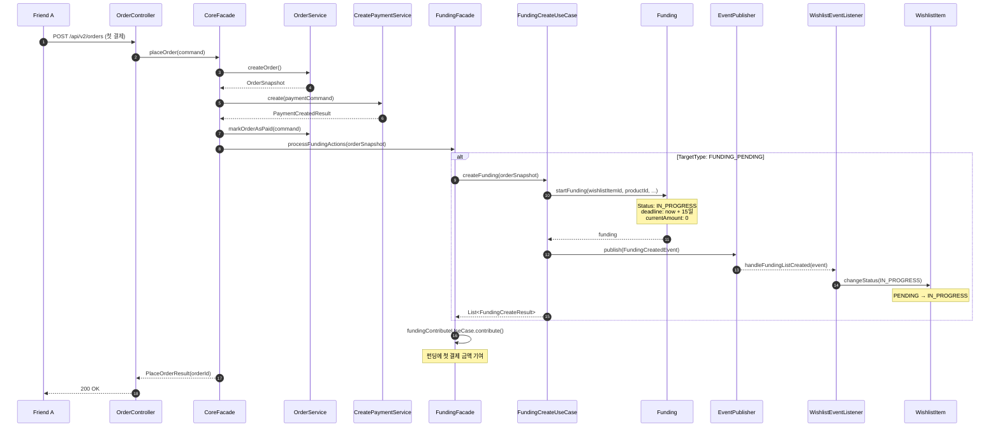

# 4.1 펀딩 라이프사이클 - Sequence Diagram

## Diagram

## 주요 흐름

1. Friend A가 위시리스트 상품(PENDING)에 대해 첫 결제를 요청
2. CoreFacade가 OrderService.createOrder()로 Order 생성
3. CoreFacade가 CreatePaymentService.create()로 Payment 생성 후 Order를 PAID로 변경
4. CoreFacade가 FundingFacade.processFundingActions()를 호출
5. TargetType이 FUNDING_PENDING인 항목에 대해 FundingCreateUseCase.createFunding() 호출
6. Funding.startFunding()으로 새 Funding 생성 (Status: IN_PROGRESS, deadline: 현재 + 15일)
7. FundingCreatedEvent 발행
8. WishlistEventListener가 이벤트를 수신하여 WishlistItem 상태를 PENDING → IN_PROGRESS로 변경
9. FundingFacade가 초기 기여 처리 (fundingContributeUseCase.contribute())

## 핵심 포인트

- CoreFacade → FundingFacade → FundingCreateUseCase 계층으로 호출
- Payment 생성은 CoreFacade에서 처리하며, 펀딩 생성과 분리됨
- 펀딩 생성과 위시리스트 상태 변경은 이벤트 기반으로 분리
- 펀딩 생성 후 FundingFacade에서 즉시 초기 기여가 처리됨
- FundingStatus: IN_PROGRESS (펀딩 진행 중)
- WishlistItemStatus: PENDING → IN_PROGRESS

## 관련 문서
- [User Story & Acceptance Criteria](../user-stories/4.1-funding-lifecycle.md)
- [메인 기획서](../requirements/260112-PRD-giftify-requirements.md#41-펀딩-라이프사이클-funding-lifecycle)
