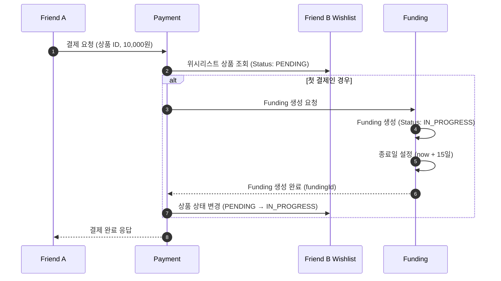

# 4.1 펀딩 라이프사이클 - Sequence Diagram

## Diagram

## 주요 흐름

1. Friend A가 위시리스트 상품에 대해 첫 결제를 시도
2. Payment 서비스가 위시리스트 상품 조회 (PENDING 상태 확인)
3. Funding 객체 생성 (IN_PROGRESS 상태)
4. 펀딩 종료일 자동 설정 (+15일)
5. 위시리스트 상품 상태를 IN_PROGRESS로 변경
6. 결제 완료 응답 반환

## 관련 문서
- [User Story & Acceptance Criteria](../user-stories/4.1-funding-lifecycle.md)
- [메인 기획서](../requirements/260112-PRD-giftify-requirements.md#41-펀딩-라이프사이클-funding-lifecycle)
