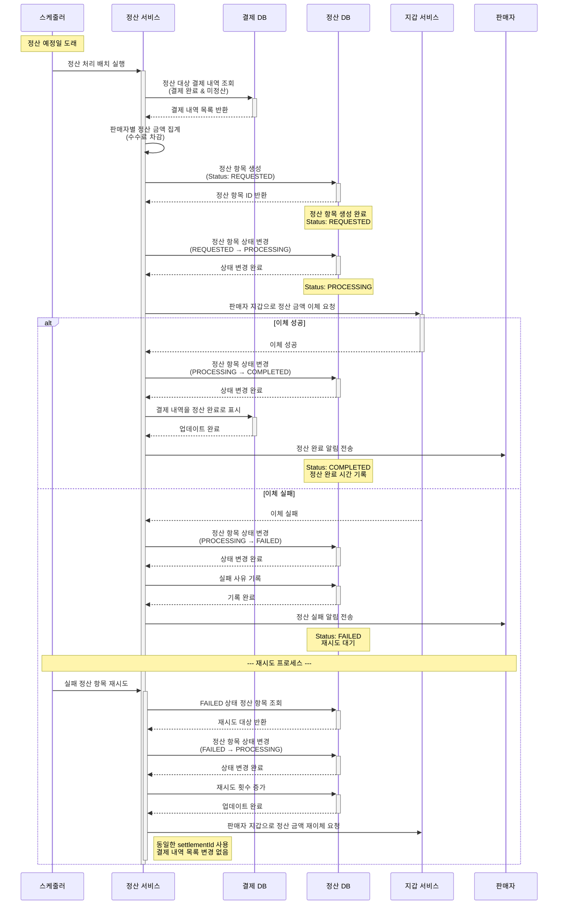

# 4.10 판매금 정산 - Sequence Diagram

## Diagram

## 주요 흐름

### 1. 정산 대상 생성 (REQUESTED)
1. 정산 예정일에 스케줄러 실행
2. 정산 대상 결제 내역 조회 (결제 완료 & 미정산)
3. 판매자별 정산 금액 집계 (수수료 차감)
4. 정산 항목 생성 (REQUESTED 상태)
5. 정산 금액 및 대상 결제 내역 확정

### 2. 정산 지급 처리 (PROCESSING)
1. 정산 항목 상태를 PROCESSING으로 변경
2. 지급 처리 시작 시간 기록
3. 판매자 지갑으로 정산 금액 이체 요청

### 3. 정산 완료 (COMPLETED)
1. 이체 성공
2. 정산 항목 상태를 COMPLETED로 변경
3. 정산 완료 시간 기록
4. 결제 내역을 정산 완료로 표시
5. 판매자에게 정산 완료 알림

### 4. 정산 실패 (FAILED)
1. 이체 실패
2. 정산 항목 상태를 FAILED로 변경
3. 실패 사유 및 실패 시간 기록
4. 판매자에게 정산 실패 알림
5. 재시도 대기

### 5. 재시도 프로세스
1. FAILED 상태 정산 항목 조회
2. 정산 항목 상태를 PROCESSING으로 변경
3. 재시도 횟수 증가
4. 동일한 settlementId로 재이체 시도
5. 결제 내역 목록은 변경 없이 유지

## 핵심 포인트
- **상태 관리**: REQUESTED → PROCESSING → COMPLETED/FAILED
- **금액 확정**: 정산 대상 결제 내역은 생성 시점에 확정
- **재시도 메커니즘**: 실패 시 동일 정산 항목으로 재시도
- **멱등성**: 동일 settlementId 사용으로 중복 지급 방지
- **수수료 처리**: 정산 금액 계산 시 서비스 수수료 차감
- **이력 관리**: 모든 정산 처리 이력 기록

## 관련 문서
- [User Story & Acceptance Criteria](../user-stories/4.10-settlement.md)
- [메인 기획서](../requirements/260112-PRD-giftify-requirements.md#410-판매금-정산)
