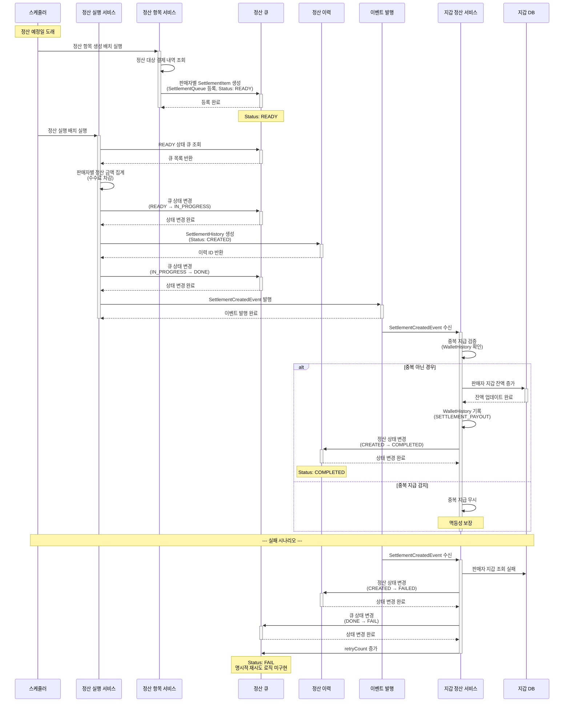

# 4.10 판매금 정산 - Sequence Diagram

## Diagram

## 주요 흐름

### 1. 정산 항목 생성 (SettlementItem)
1. 정산 예정일에 스케줄러 실행
2. 정산 대상 결제 내역 조회 (결제 완료 & 미정산)
3. 판매자별 SettlementItem 생성
4. SettlementQueue에 등록 (READY 상태)

### 2. 정산 실행 (SettlementQueue → SettlementHistory)
1. READY 상태 큐 조회
2. 판매자별 정산 금액 집계 (수수료 차감)
3. 큐 상태를 IN_PROGRESS로 변경
4. SettlementHistory 생성 (CREATED 상태)
5. 큐 상태를 DONE으로 변경
6. SettlementCreatedEvent 발행

### 3. 지갑 지급 처리 (WalletSettlementService)
1. SettlementCreatedEvent 수신
2. WalletHistory에서 중복 지급 검증 (멱등성)
3. 판매자 Wallet 잔액 직접 증가
4. WalletHistory 기록 (SETTLEMENT_PAYOUT)
5. SettlementHistory 상태를 COMPLETED로 변경

### 4. 정산 실패 (FAILED)
1. 지갑 조회 실패 또는 예외 발생
2. SettlementHistory 상태를 FAILED로 변경
3. SettlementQueue 상태를 FAIL로 변경
4. retryCount 증가 (명시적 재시도 로직 미구현)

## 핵심 포인트
- **상태 관리 (SettlementQueue)**: READY → IN_PROGRESS → DONE/FAIL
- **상태 관리 (SettlementHistory)**: CREATED → COMPLETED/FAILED
- **이벤트 기반**: SettlementCreatedEvent 발행 → WalletSettlementService 수신
- **멱등성**: WalletHistory 중복 검증으로 중복 지급 방지
- **직접 잔액 증가**: 외부 이체 API 없음, Wallet 잔액 직접 증가
- **재시도**: retryCount만 증가, 명시적 재시도 로직 미구현
- **수수료 처리**: 정산 금액 계산 시 서비스 수수료 차감
- **이력 관리**: SettlementHistory와 WalletHistory에 기록

## 관련 문서
- [User Story & Acceptance Criteria](../user-stories/4.10-settlement.md)
- [메인 기획서](../requirements/260112-PRD-giftify-requirements.md#410-판매금-정산)
