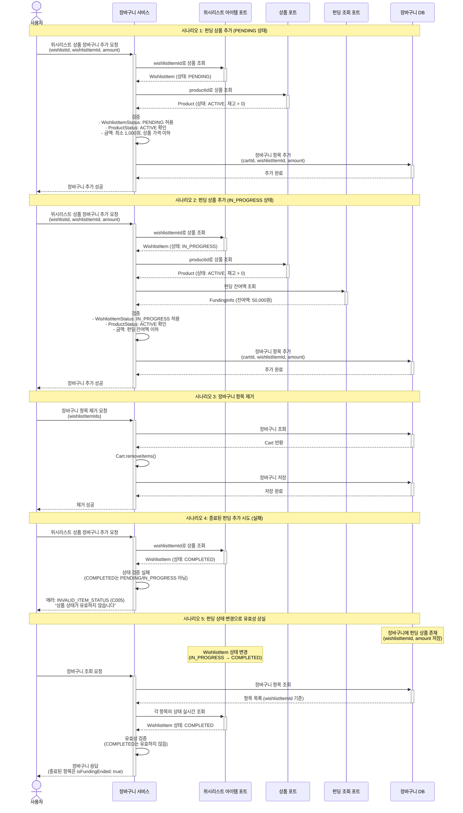

# 4.11 장바구니 관리 - Sequence Diagram

## Diagram

## 주요 흐름

### 1. 펀딩 상품 추가 (PENDING 상태)
1. 사용자가 위시리스트 상품 추가 요청 (wishlistId, wishlistItemId, amount 포함)
2. WishlistItemPort로 WishlistItem 조회 (상태: PENDING)
3. ProductPort로 Product 조회 (상태: ACTIVE 확인)
4. 검증: WishlistItemStatus는 PENDING/IN_PROGRESS만 허용
5. 검증: 금액은 최소 1,000원 이상, 상품 가격 이하
6. 장바구니에 항목 추가 (cartId, wishlistItemId, amount만 저장)
7. 추가 성공 응답

### 2. 펀딩 상품 추가 (IN_PROGRESS 상태)
1. 사용자가 위시리스트 상품 추가 요청
2. WishlistItemPort로 WishlistItem 조회 (상태: IN_PROGRESS)
3. ProductPort로 Product 조회
4. FundingQueryPort로 펀딩 잔여액 실시간 조회
5. 검증: 금액은 펀딩 잔여액 이하
6. 장바구니에 항목 추가 (cartId, wishlistItemId, amount만 저장)
7. 추가 성공 응답

### 3. 장바구니 항목 제거
1. 사용자가 항목 제거 요청 (wishlistItemIds 목록)
2. 장바구니 조회 (Cart 도메인)
3. Cart.removeItems()로 항목 제거
4. 장바구니 저장
5. 제거 성공 응답

### 4. 종료된 펀딩 추가 시도
1. 사용자가 상품 추가 요청
2. WishlistItem 조회 (상태: COMPLETED)
3. 상태 검증 실패 (COMPLETED는 허용되지 않음)
4. 에러 코드 C005 (INVALID_ITEM_STATUS) 반환

### 5. 펀딩 상태 변경으로 유효성 상실
1. 장바구니에 펀딩 상품 존재 (wishlistItemId, amount만 저장)
2. WishlistItem 상태 변경 (IN_PROGRESS → COMPLETED)
3. 사용자가 장바구니 조회 요청
4. 각 wishlistItemId의 상태 실시간 조회
5. 종료된 항목은 isFundingEnded: true로 응답에 포함
6. 프론트엔드에서 해당 항목 비활성화 처리

## 핵심 포인트
- **Port 기반 통신**: CartService는 WishlistItemRepositoryPort + ProductRepositoryPort + FundingQueryPort를 직접 사용
- **최소 데이터 저장**: CartItem에는 cartId, wishlistItemId, amount만 저장 (상태는 저장하지 않음)
- **실시간 상태 조회**: 장바구니 조회 시 WishlistItem 상태를 실시간으로 확인
- **상태 검증**: PENDING 또는 IN_PROGRESS 상태만 장바구니 추가 허용 (CartService.java:100-103)
- **에러 코드**: 유효하지 않은 상태는 C005 (INVALID_ITEM_STATUS) 반환
- **API**: POST /api/v2/carts (추가), DELETE /api/v2/carts/items (제거)
- **요청 파라미터**: wishlistId + wishlistItemId 모두 필요

## 관련 문서
- [User Story & Acceptance Criteria](../user-stories/4.11-cart-management.md)
- [메인 기획서](../requirements/260112-PRD-giftify-requirements.md#411-장바구니-관리)
