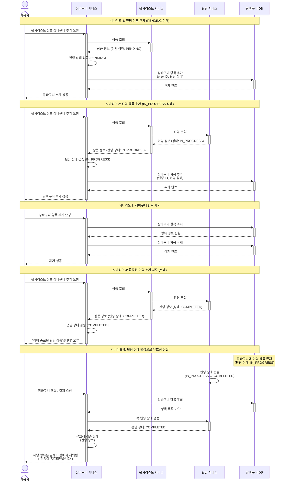

# 4.11 장바구니 관리 - Sequence Diagram

## Diagram

## 주요 흐름

### 1. 펀딩 상품 추가 (PENDING 상태)
1. 사용자가 위시리스트 상품 추가 요청
2. 위시리스트 서비스에서 상품 조회
3. 펀딩 상태 검증 (PENDING)
4. 장바구니에 항목 추가 (상품 ID, 펀딩 상태)
5. 추가 성공 응답

### 2. 펀딩 상품 추가 (IN_PROGRESS 상태)
1. 사용자가 위시리스트 상품 추가 요청
2. 위시리스트 및 펀딩 서비스에서 상품/펀딩 조회
3. 펀딩 상태 검증 (IN_PROGRESS)
4. 장바구니에 항목 추가 (펀딩 ID, 펀딩 상태)
5. 추가 성공 응답

### 3. 장바구니 항목 제거
1. 사용자가 항목 제거 요청
2. 장바구니 항목 조회
3. 장바구니 항목 삭제
4. 제거 성공 응답

### 4. 종료된 펀딩 추가 시도
1. 사용자가 상품 추가 요청
2. 상품 및 펀딩 조회 (상태: COMPLETED)
3. 펀딩 상태 검증 실패
4. "이미 종료된 펀딩 상품입니다" 오류 반환

### 5. 펀딩 상태 변경으로 유효성 상실
1. 장바구니에 펀딩 상품 존재 (IN_PROGRESS)
2. 펀딩 상태 변경 (IN_PROGRESS → COMPLETED)
3. 사용자가 장바구니 조회/결제 요청
4. 각 펀딩 상태 실시간 검증
5. 종료된 펀딩은 결제 대상에서 제외
6. 사용자에게 안내 메시지 표시

## 핵심 포인트
- **상태 검증**: 장바구니 추가 시 펀딩 상태 검증
- **실시간 확인**: 결제 시 펀딩 상태 재확인
- **명확한 오류**: 종료/만료된 펀딩 추가 시도 시 명확한 오류 메시지
- **유효성 관리**: 펀딩 상태 변경 시 장바구니 항목 자동 무효화

## 관련 문서
- [User Story & Acceptance Criteria](../user-stories/4.11-cart-management.md)
- [메인 기획서](../requirements/260112-PRD-giftify-requirements.md#411-장바구니-관리)
