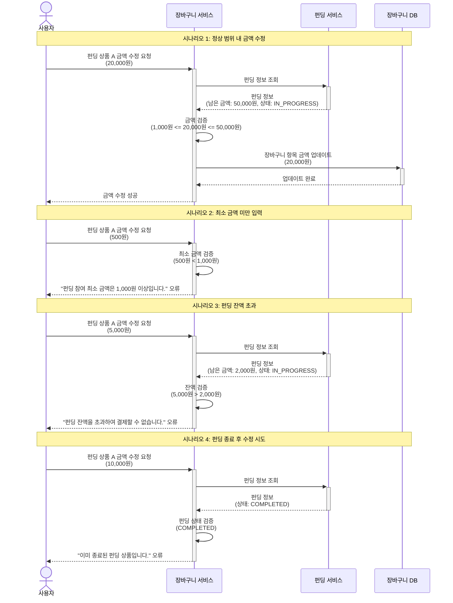

# 4.12 장바구니 내 금액 수정 - Sequence Diagram

## Diagram

## 주요 흐름

### 1. 정상 범위 내 금액 수정
1. 사용자가 펀딩 상품 A의 금액을 20,000원으로 수정 요청
2. 펀딩 정보 조회 (남은 금액: 50,000원, 상태: IN_PROGRESS)
3. 금액 검증 (최소 1,000원 이상, 최대 50,000원 이하)
4. 장바구니 항목 금액 업데이트
5. 수정 성공 응답

### 2. 최소 금액 미만 입력
1. 사용자가 500원으로 수정 요청
2. 최소 금액 검증 (500원 < 1,000원)
3. "펀딩 참여 최소 금액은 1,000원 이상입니다." 오류 반환

### 3. 펀딩 잔액 초과
1. 사용자가 5,000원으로 수정 요청
2. 펀딩 정보 조회 (남은 금액: 2,000원)
3. 잔액 검증 (5,000원 > 2,000원)
4. "펀딩 잔액을 초과하여 결제할 수 없습니다." 오류 반환

### 4. 펀딩 종료 후 수정 시도
1. 사용자가 10,000원으로 수정 요청
2. 펀딩 정보 조회 (상태: COMPLETED)
3. 펀딩 상태 검증 실패
4. "이미 종료된 펀딩 상품입니다." 오류 반환

## 핵심 포인트
- **실시간 검증**: 펀딩 정보를 실시간으로 조회하여 검증
- **다중 검증**: 최소 금액, 최대 금액(잔액), 펀딩 상태 모두 검증
- **명확한 오류**: 각 실패 케이스별 명확한 오류 메시지 제공
- **원자성**: 검증 실패 시 장바구니는 변경되지 않음

## 관련 문서
- [User Story & Acceptance Criteria](../user-stories/4.12-cart-amount-edit.md)
- [메인 기획서](../requirements/260112-PRD-giftify-requirements.md#412-장바구니-내-금액-수정)
