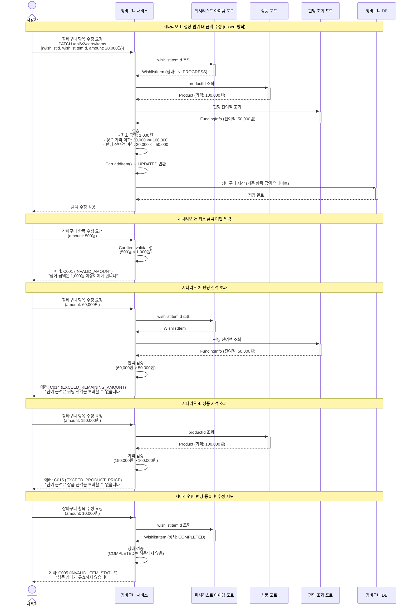

# 4.12 장바구니 내 금액 수정 - Sequence Diagram

## Diagram

## 주요 흐름

### 1. 정상 범위 내 금액 수정 (upsert 방식)
1. 사용자가 장바구니 항목 수정 요청 (PATCH /api/v2/carts/items, List<CartItemRequest>)
2. WishlistItem 조회 및 상태 검증 (PENDING 또는 IN_PROGRESS)
3. Product 조회 및 가격 검증 (amount <= 상품 가격)
4. FundingInfo 조회 및 잔여액 검증 (amount <= 잔여액)
5. Cart.addItem() 호출 → 기존 항목 있으면 UPDATED, 없으면 ADDED 반환
6. 장바구니 저장
7. 수정 성공 응답

### 2. 최소 금액 미만 입력
1. 사용자가 500원으로 수정 요청
2. CartItem.validate() 호출 (CartItem.java:38-42)
3. 에러 코드 C001 (INVALID_AMOUNT) 발생
4. "참여 금액은 1,000원 이상이여야 합니다" 메시지 반환

### 3. 펀딩 잔액 초과
1. 사용자가 60,000원으로 수정 요청
2. FundingQueryPort로 펀딩 잔여액 조회 (50,000원)
3. 잔액 검증 실패 (CartService.java:119-124)
4. 에러 코드 C014 (EXCEED_REMAINING_AMOUNT) 반환

### 4. 상품 가격 초과
1. 사용자가 150,000원으로 수정 요청
2. Product 조회 (가격: 100,000원)
3. 가격 검증 실패 (CartService.java:114-116)
4. 에러 코드 C015 (EXCEED_PRODUCT_PRICE) 반환

### 5. 펀딩 종료 후 수정 시도
1. 사용자가 10,000원으로 수정 요청
2. WishlistItem 조회 (상태: COMPLETED)
3. 상태 검증 실패 (COMPLETED는 PENDING/IN_PROGRESS 아님)
4. 에러 코드 C005 (INVALID_ITEM_STATUS) 반환

## 핵심 포인트
- **Upsert 방식**: 단건 수정 API 없음, PATCH /api/v2/carts/items로 복수 항목 일괄 처리
- **항목 존재 확인**: Cart.addItem()이 기존 항목 유무에 따라 UPDATED/ADDED 반환
- **최소 금액 검증**: 1,000원 이상 (CartItem.java:15, 38-42)
- **펀딩 잔액 검증**: 펀딩 잔여액 초과 불가 (CartService.java:119-124)
- **상품 가격 검증**: 상품 가격 초과 불가 (CartService.java:114-116)
- **에러 코드**: C001 (최소 금액), C005 (상태 오류), C014 (잔액 초과), C015 (가격 초과)
- **실시간 조회**: 펀딩 잔여액은 FundingQueryPort로 실시간 조회
- **원자성**: 검증 실패 시 장바구니는 변경되지 않음

## 관련 문서
- [User Story & Acceptance Criteria](../user-stories/4.12-cart-amount-edit.md)
- [메인 기획서](../requirements/260112-PRD-giftify-requirements.md#412-장바구니-내-금액-수정)
