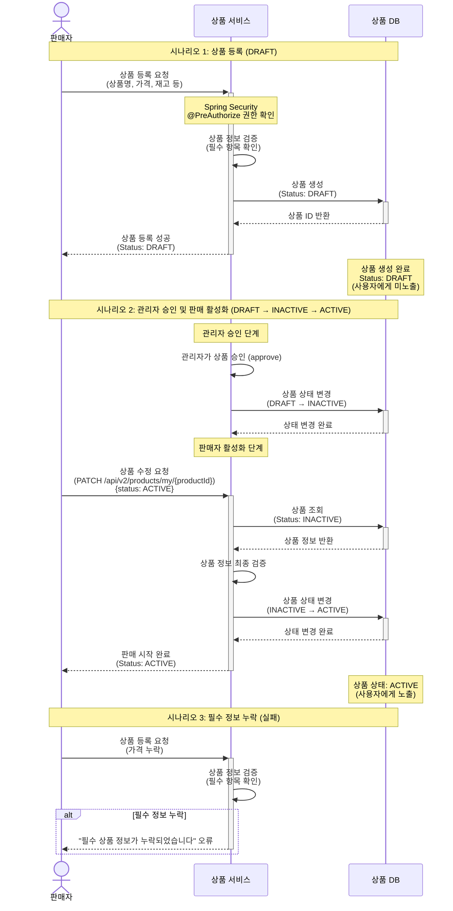

# 4.13 판매자 상품 등록 - Sequence Diagram

## Diagram

## 주요 흐름

### 1. 상품 등록 (DRAFT)
1. 판매자가 상품 정보 입력 (상품명, 가격, 재고 등)
2. 판매자 권한 확인 (Spring Security @PreAuthorize)
3. 상품 정보 검증 (필수 항목 확인)
4. 상품 생성 (DRAFT 상태)
5. 상품 등록 성공 응답
6. DRAFT 상태에서는 사용자에게 미노출

### 2. 관리자 승인 및 판매 활성화 (DRAFT → INACTIVE → ACTIVE)
1. 관리자가 상품 승인 (Product.approve() 호출)
2. 상품 상태를 INACTIVE로 변경
3. 판매자가 상품 수정 API로 status: ACTIVE 요청 (PATCH /api/v2/products/my/{productId})
4. 상품 조회 (INACTIVE 상태 확인)
5. 상품 정보 최종 검증
6. 상품 상태를 ACTIVE로 변경 (Product.active() 호출)
7. 판매 시작 완료 응답
8. ACTIVE 상태에서는 사용자에게 노출

### 3. 필수 정보 누락 (실패)
1. 판매자가 필수 항목 누락된 상태로 등록 요청
2. 상품 정보 검증 실패
3. "필수 상품 정보가 누락되었습니다" 오류 반환
4. 상품은 생성되지 않음

## 핵심 포인트
- **3단계 프로세스**: DRAFT → INACTIVE(관리자 승인) → ACTIVE(판매자 활성화) 단계적 상품 등록
- **권한 검증**: Spring Security @PreAuthorize로 판매자 권한 확인
- **필수 항목 검증**: 상품명, 가격 등 필수 정보 검증
- **노출 제어**: DRAFT/INACTIVE 상태에서는 미노출, ACTIVE 상태에서만 노출
- **승인 절차**: 관리자 승인 후 판매자가 직접 활성화

## 관련 문서
- [User Story & Acceptance Criteria](../user-stories/4.13-product-registration.md)
- [메인 기획서](../requirements/260112-PRD-giftify-requirements.md#413-판매자-상품-등록)
