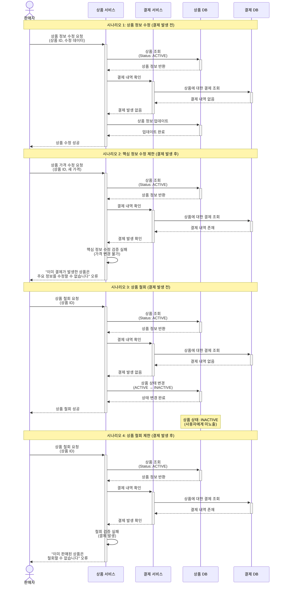

# 4.14 판매자의 판매 상품 수정/철회 - Sequence Diagram

## Diagram

## 주요 흐름

### 1. 상품 정보 수정 (결제 발생 전)
1. 판매자가 상품 정보 수정 요청
2. 상품 조회 (ACTIVE 상태)
3. 결제 내역 확인 (결제 없음)
4. 상품 정보 업데이트
5. 수정 성공 응답
6. 수정된 정보는 즉시 사용자에게 노출

### 2. 핵심 정보 수정 제한 (결제 발생 후)
1. 판매자가 가격 수정 요청
2. 상품 조회 (ACTIVE 상태)
3. 결제 내역 확인 (결제 존재)
4. 핵심 정보 수정 검증 실패
5. "이미 결제가 발생한 상품은 주요 정보를 수정할 수 없습니다" 오류 반환

### 3. 상품 철회 (결제 발생 전)
1. 판매자가 상품 철회 요청
2. 상품 조회 (ACTIVE 상태)
3. 결제 내역 확인 (결제 없음)
4. 상품 상태를 INACTIVE로 변경
5. 철회 성공 응답
6. 사용자에게 더 이상 노출되지 않음

### 4. 상품 철회 제한 (결제 발생 후)
1. 판매자가 상품 철회 요청
2. 상품 조회 (ACTIVE 상태)
3. 결제 내역 확인 (결제 존재)
4. 철회 검증 실패
5. "이미 판매된 상품은 철회할 수 없습니다" 오류 반환

## 핵심 포인트
- **결제 내역 검증**: 수정/철회 전 결제 발생 여부 확인
- **핵심 정보 보호**: 결제 발생 후 가격 등 핵심 정보 수정 불가
- **철회 제한**: 결제 발생 후 상품 철회 불가
- **명확한 오류**: 각 제한 케이스별 명확한 오류 메시지

## 관련 문서
- [User Story & Acceptance Criteria](../user-stories/4.14-product-edit-withdraw.md)
- [메인 기획서](../requirements/260112-PRD-giftify-requirements.md#414-판매자의-판매-상품-수정철회)
