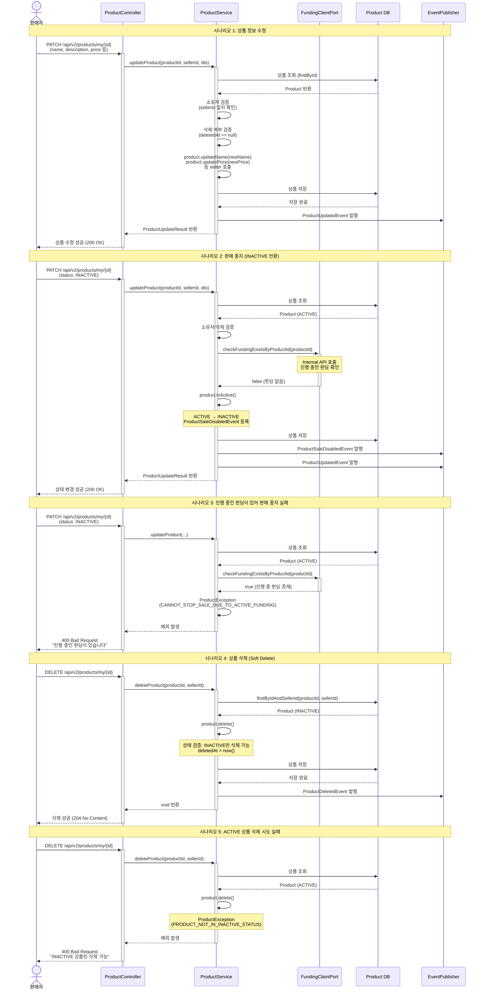

# 4.14 판매자의 판매 상품 수정/삭제 - Sequence Diagram

## Diagram

## 주요 흐름

### 1. 상품 정보 수정
1. 판매자가 `PATCH /api/v2/products/my/{id}` 요청
2. 상품 조회 후 소유자 검증
3. 삭제되지 않은 상품인지 확인
4. `product.updateName()`, `product.updatePrice()` 등 호출
5. 상품 저장 후 `ProductUpdatedEvent` 발행
6. 수정 성공 응답

### 2. 판매 중지 (ACTIVE → INACTIVE)
1. 판매자가 `status: INACTIVE`로 수정 요청
2. `FundingClientPort.checkFundingExistsByProductId()` 호출
3. 진행 중인 펀딩이 없으면 `product.inActive()` 호출
4. ACTIVE → INACTIVE 전환 (`ProductSaleDisabledEvent` 등록)
5. 상품 저장 후 이벤트 발행
6. 상태 변경 성공

### 3. 진행 중인 펀딩으로 판매 중지 실패
1. 판매자가 `status: INACTIVE`로 수정 요청
2. `FundingClientPort.checkFundingExistsByProductId()` → true
3. `ProductException(CANNOT_STOP_SALE_DUE_TO_ACTIVE_FUNDING)` 발생
4. 400 Bad Request 응답

### 4. 상품 삭제 (Soft Delete)
1. 판매자가 `DELETE /api/v2/products/my/{id}` 요청
2. 상품 조회 및 소유자 확인
3. `product.delete()` 호출
4. 상태 검증: INACTIVE 상품만 삭제 가능
5. `deletedAt = now()` 설정
6. `ProductDeletedEvent` 발행
7. 삭제 성공 (204 No Content)

### 5. ACTIVE 상품 삭제 시도 실패
1. 판매자가 ACTIVE 상품 삭제 시도
2. `product.delete()` 내부에서 상태 검증
3. `ProductException(PRODUCT_NOT_IN_INACTIVE_STATUS)` 발생
4. 400 Bad Request 응답

## 핵심 포인트
- **결제 내역 검증 없음**: 현재 구현에는 Payment 확인 로직이 없음 (펀딩만 확인)
- **펀딩 진행 여부 확인**: INACTIVE 전환 시 `FundingClientPort`로 펀딩 존재 여부 확인
- **BC 경계 준수**: Port 인터페이스를 통한 모듈 간 통신
- **철회 개념 없음**: "철회"는 없고 "판매 중지(INACTIVE)"와 "삭제(Soft Delete)"만 존재
- **삭제 조건**: INACTIVE 상태에서만 삭제 가능
- **Soft Delete**: `deletedAt` 타임스탬프로 관리, Hard Delete는 배치로 처리

## 관련 문서
- [User Story & Acceptance Criteria](../user-stories/4.14-product-edit-withdraw.md)
- [메인 기획서](../requirements/260112-PRD-giftify-requirements.md#414-판매자의-판매-상품-수정철회)
