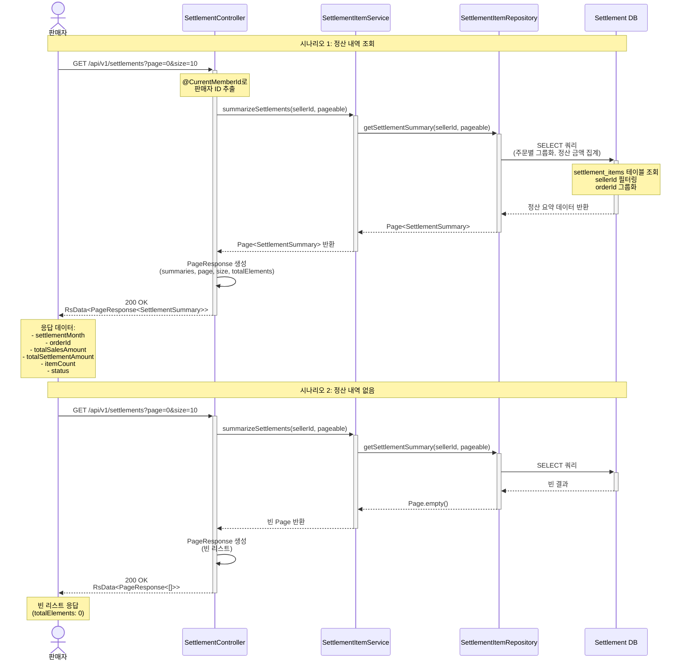

# 4.15 판매자의 정산 내역 조회 - Sequence Diagram

## Diagram

## 주요 흐름

### 1. 정산 내역 조회
1. 판매자가 `GET /api/v1/settlements?page=0&size=10` 요청
2. `@CurrentMemberId`로 판매자 ID 추출
3. `SettlementItemService.summarizeSettlements()` 호출
4. `SettlementItemRepository.getSettlementSummary()` 호출
5. settlement_items 테이블에서 sellerId로 필터링하여 조회
6. orderId 기준 그룹화, 정산 금액 집계
7. `Page<SettlementSummary>` 반환
8. `PageResponse` 생성 후 200 OK 응답

### 2. 정산 내역 없음
1. 판매자가 정산 조회 API 호출
2. DB 조회 결과 빈 리스트
3. `Page.empty()` 반환
4. 빈 `PageResponse` (totalElements: 0) 응답

## SettlementSummary 구조

| 필드                     | 타입   | 설명                       |
|------------------------|------|--------------------------|
| settlementMonth        | String | 정산 월 (YYYY-MM)         |
| orderId                | Long | 주문 ID                   |
| totalSalesAmount       | Long | 총 판매 금액                 |
| totalSettlementAmount  | Long | 총 정산 금액 (수수료 차감 후)     |
| itemCount              | Long | 정산 아이템 개수               |
| status                 | String | 정산 상태                   |

## 핵심 포인트
- **실시간 판매 내역 조회 불가**: 정산 배치 완료 후 데이터만 조회 가능
- **필터링 기능 없음**: 기간, 상태별 필터 파라미터 미지원 (Pageable만 사용)
- **정산 완료 데이터만**: 주문 확정 후 배치가 실행된 정산 내역만 조회됨
- **주문 기준 집계**: orderId 그룹화로 주문별 정산 요약 제공
- **페이징 지원**: Pageable로 페이지네이션 처리

## 관련 문서
- [User Story & Acceptance Criteria](../user-stories/4.15-recent-sales-list.md)
- [메인 기획서](../requirements/260112-PRD-giftify-requirements.md#415-판매자의-최근-판매-상품-목록-조회)
