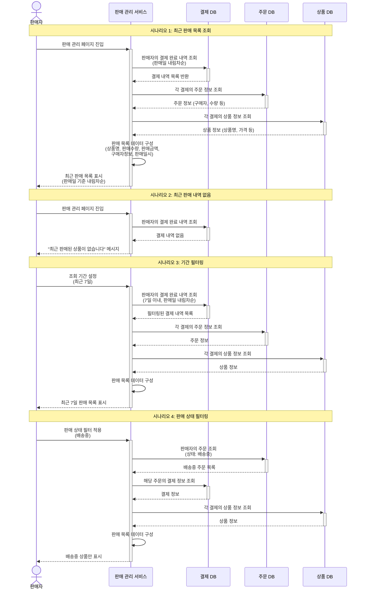

# 4.15 판매자의 최근 판매 상품 목록 조회 - Sequence Diagram

## Diagram

## 주요 흐름

### 1. 최근 판매 목록 조회
1. 판매자가 판매 관리 페이지 진입
2. 판매자의 결제 완료 내역 조회 (판매일 내림차순)
3. 각 결제의 주문 정보 조회 (구매자, 수량 등)
4. 각 결제의 상품 정보 조회 (상품명, 가격 등)
5. 판매 목록 데이터 구성
6. 최근 판매 목록 표시 (판매일 기준 내림차순)

### 2. 최근 판매 내역 없음
1. 판매자가 판매 관리 페이지 진입
2. 판매자의 결제 완료 내역 조회
3. 결제 내역 없음
4. "최근 판매된 상품이 없습니다" 메시지 표시

### 3. 기간 필터링
1. 판매자가 조회 기간 설정 (최근 7일)
2. 7일 이내 결제 완료 내역 조회
3. 필터링된 결제의 주문/상품 정보 조회
4. 판매 목록 데이터 구성
5. 최근 7일 판매 목록 표시

### 4. 판매 상태 필터링
1. 판매자가 판매 상태 필터 적용 (배송중)
2. 배송중 상태 주문 조회
3. 해당 주문의 결제 정보 조회
4. 각 결제의 상품 정보 조회
5. 판매 목록 데이터 구성
6. 배송중 상품만 표시

## 핵심 포인트
- **다중 데이터 조합**: 결제, 주문, 상품 정보를 조합하여 완전한 판매 목록 제공
- **정렬**: 판매일 기준 내림차순 정렬
- **필터링**: 기간 및 판매 상태별 필터링 지원
- **핵심 정보 제공**: 상품명, 판매수량, 판매금액, 구매자정보, 판매일시 포함
- **빈 상태 처리**: 판매 내역 없을 시 명확한 메시지 표시

## 관련 문서
- [User Story & Acceptance Criteria](../user-stories/4.15-recent-sales-list.md)
- [메인 기획서](../requirements/260112-PRD-giftify-requirements.md#415-판매자의-최근-판매-상품-목록-조회)
