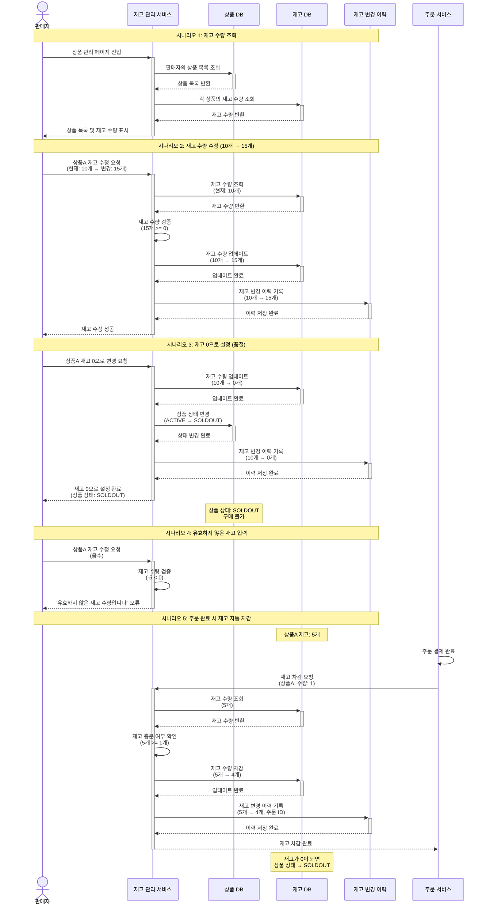

# 4.16 판매자의 상품 재고 관리 - Sequence Diagram

## Diagram

## 주요 흐름

### 1. 재고 수량 조회
1. 판매자가 상품 관리 페이지 진입
2. 판매자의 상품 목록 조회
3. 각 상품의 재고 수량 조회
4. 상품 목록 및 재고 수량 표시

### 2. 재고 수량 수정 (10개 → 15개)
1. 판매자가 상품A 재고 수정 요청 (15개)
2. 현재 재고 수량 조회 (10개)
3. 재고 수량 검증 (15개 >= 0)
4. 재고 수량 업데이트 (10개 → 15개)
5. 재고 변경 이력 기록
6. 재고 수정 성공 응답

### 3. 재고 0으로 설정 (품절)
1. 판매자가 상품A 재고 0으로 변경 요청
2. 재고 수량 업데이트 (10개 → 0개)
3. 상품 상태 변경 (ACTIVE → SOLDOUT)
4. 재고 변경 이력 기록
5. 재고 0 설정 완료 (상품 상태: SOLDOUT)
6. 구매자는 해당 상품 구매 불가

### 4. 유효하지 않은 재고 입력
1. 판매자가 음수 재고 입력
2. 재고 수량 검증 실패 (-5 < 0)
3. "유효하지 않은 재고 수량입니다" 오류 반환

### 5. 주문 완료 시 재고 자동 차감
1. 주문 결제 완료
2. 재고 차감 요청 (수량: 1)
3. 현재 재고 수량 조회 (5개)
4. 재고 충분 여부 확인 (5개 >= 1개)
5. 재고 수량 차감 (5개 → 4개)
6. 재고 변경 이력 기록 (주문 ID 포함)
7. 재고 차감 완료
8. 재고가 0이 되면 상품 상태를 SOLDOUT로 변경

## 핵심 포인트
- **재고 조회**: 판매자가 모든 상품의 재고 수량을 한눈에 확인
- **재고 수정**: 판매자가 직접 재고 수량 조정 가능
- **검증**: 음수 등 유효하지 않은 재고 수량 입력 방지
- **자동 차감**: 주문 완료 시 재고 자동 차감
- **품절 처리**: 재고 0일 때 상품 상태를 SOLDOUT로 변경
- **이력 관리**: 모든 재고 변경 이력 기록

## 관련 문서
- [User Story & Acceptance Criteria](../user-stories/4.16-inventory-management.md)
- [메인 기획서](../requirements/260112-PRD-giftify-requirements.md#416-판매자의-상품-재고-관리)
