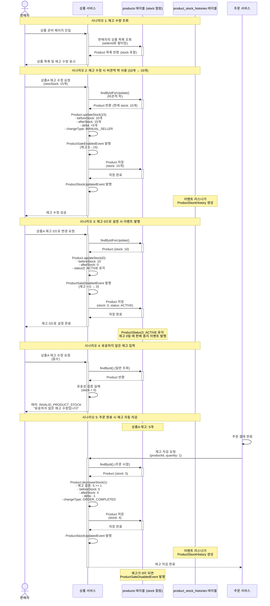

# 4.16 판매자의 상품 재고 관리 - Sequence Diagram

## Diagram

## 주요 흐름

### 1. 재고 수량 조회
1. 판매자가 상품 관리 페이지 진입
2. ProductService가 sellerId로 상품 목록 조회
3. Product 엔티티에 stock 컬럼이 포함되어 있음 (별도 재고 테이블 없음)
4. 상품 목록 및 재고 수량 표시

### 2. 재고 수정 시 비관적 락 사용 (10개 → 15개)
1. 판매자가 상품A 재고 수정 요청 (newStock: 15개)
2. ProductService가 findByIdForUpdate()로 비관적 락 획득 (ProductService.java:169-189)
3. Product.updateStock(15) 호출
4. beforeStock: 10, afterStock: 15, delta: +5, changeType: MANUAL_SELLER
5. 재고 0→15 전환 시 ProductSaleEnabledEvent 발행 (Product.java:144-146)
6. ProductStockUpdatedEvent 발행 (Product.java:148)
7. 이벤트 리스너가 ProductStockHistory 생성
8. 재고 수정 성공 응답

### 3. 재고 0으로 설정 시 이벤트 발행
1. 판매자가 상품A 재고 0으로 변경 요청
2. Product.updateStock(0) 호출
3. beforeStock: 10, afterStock: 0
4. ProductSaleDisabledEvent 발행 (Product.java:141-143)
5. ProductStatus는 ACTIVE 유지 (SOLDOUT 상태 없음)
6. 재고 0 설정 완료
7. 프론트엔드에서 품절 표시 처리

### 4. 유효하지 않은 재고 입력
1. 판매자가 음수 재고 입력
2. Product 생성/수정 시 validateCreation() 호출 (Product.java:58-59)
3. stock < 0 검증 실패
4. 에러 코드 INVALID_PRODUCT_STOCK 반환

### 5. 주문 완료 시 재고 자동 차감
1. 주문 결제 완료
2. ProductService가 재고 차감 요청 받음
3. Product.decreaseStock(quantity) 호출 (Product.java:152-162)
4. validateStockForOrder()로 재고 충분 여부 확인 (Product.java:176-180)
5. stock 감소 (5개 → 4개)
6. delta: -1, changeType: ORDER_COMPLETED
7. ProductStockUpdatedEvent 발행
8. 재고가 0이 되면 ProductSaleDisabledEvent 발행 (Product.java:158-159)

## 핵심 포인트
- **서비스명**: InventoryService 없음, ProductService가 재고 관리 담당
- **재고 저장**: 별도 재고 테이블 없음, products 테이블의 stock 컬럼 사용
- **이력 테이블**: ProductStockHistory (product_stock_histories)
- **상태**: ProductStatus에 SOLDOUT 없음 (DRAFT, REJECTED, ACTIVE, INACTIVE만 존재)
- **재고 0 처리**: ProductSaleDisabledEvent 발행, 상태는 ACTIVE 유지
- **비관적 락**: 재고 수정 시 findByIdForUpdate() 사용 (다른 필드 수정 시에는 일반 조회)
- **재고 변경 메서드**: Product.updateStock() (수동), decreaseStock() (주문), increaseStock() (반품)
- **이벤트**: ProductStockUpdatedEvent, ProductSaleDisabledEvent, ProductSaleEnabledEvent
- **검증**: stock < 0 입력 시 INVALID_PRODUCT_STOCK 에러

## 관련 문서
- [User Story & Acceptance Criteria](../user-stories/4.16-inventory-management.md)
- [메인 기획서](../requirements/260112-PRD-giftify-requirements.md#416-판매자의-상품-재고-관리)
