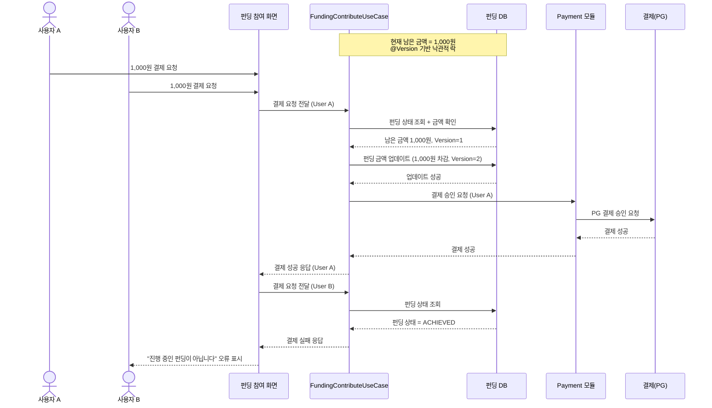

# 4.2 펀딩 참여 및 결제 - Sequence Diagram

## Diagram

## 주요 흐름

1. User A와 User B가 동시에 결제 시도
2. User A의 요청이 먼저 도착하여 처리 시작 (Version=1)
3. 남은 금액 확인 후 펀딩 금액 업데이트 (Version=2)
4. Payment 모듈을 통해 PG 결제 승인 처리
5. User A 결제 승인 및 완료
6. User B의 요청 처리 시 이미 펀딩 달성 상태 (ACHIEVED)
7. User B에게 실패 응답 반환 (NOT_IN_PROGRESS 예외)

## 핵심 포인트
- **동시성 제어**: @Version 기반 낙관적 락을 통한 순차 처리
- **모듈 분리**: Payment 모듈이 PG 연동 담당 (TossPaymentsGatewayAdapter)
- **멱등성**: 동일 결제 요청 중복 방지
- **실패 처리**: 명확한 오류 메시지 제공 (FundingErrorCode.NOT_IN_PROGRESS)

## 관련 문서
- [User Story & Acceptance Criteria](../user-stories/4.2-funding-participate-payment.md)
- [메인 기획서](../requirements/260112-PRD-giftify-requirements.md#42-펀딩-참여-및-결제-participate--payment)
