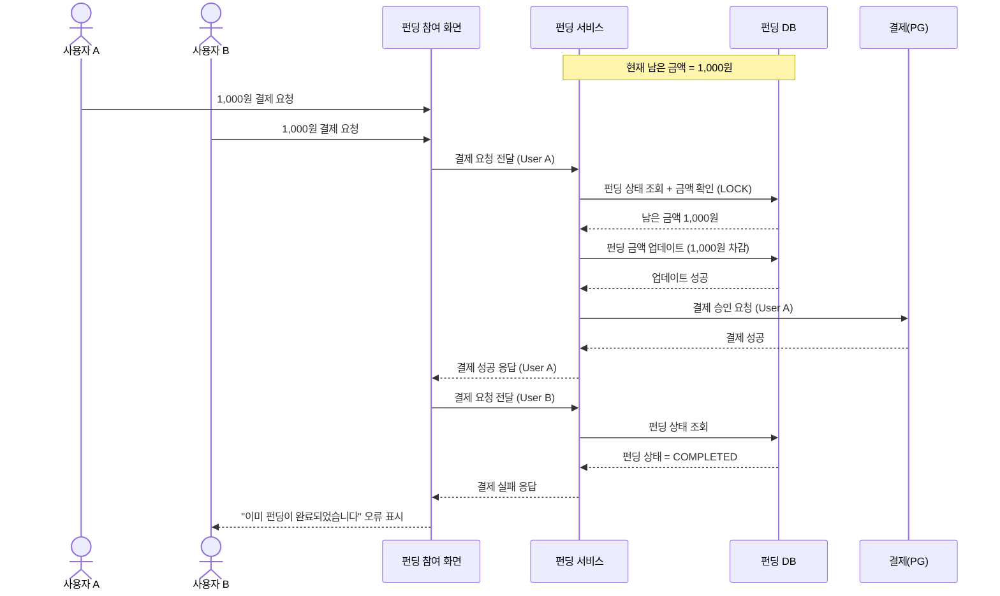

# 4.2 펀딩 참여 및 결제 - Sequence Diagram

## Diagram

## 주요 흐름

1. User A와 User B가 동시에 결제 시도
2. User A의 요청이 먼저 도착하여 DB LOCK 획득
3. 남은 금액 확인 후 펀딩 금액 업데이트
4. User A 결제 승인 및 완료
5. User B의 요청 처리 시 이미 펀딩 완료 상태
6. User B에게 실패 응답 반환

## 핵심 포인트
- **동시성 제어**: DB LOCK을 통한 순차 처리
- **멱등성**: 동일 결제 요청 중복 방지
- **실패 처리**: 명확한 오류 메시지 제공

## 관련 문서
- [User Story & Acceptance Criteria](../user-stories/4.2-funding-participate-payment.md)
- [메인 기획서](../requirements/260112-PRD-giftify-requirements.md#42-펀딩-참여-및-결제-participate--payment)
