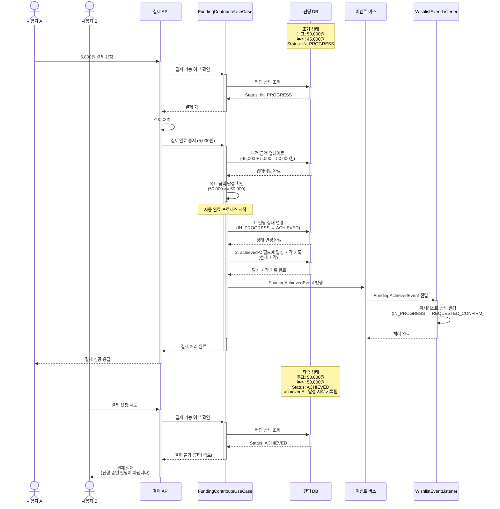

# 4.3 펀딩 완료 처리 - Sequence Diagram

## Diagram

## 주요 흐름

1. 사용자 A가 5,000원 결제 요청
2. 펀딩 상태 확인 (IN_PROGRESS)
3. 결제 처리 및 완료 통지
4. 누적 금액 업데이트 (45,000 + 5,000 = 50,000원)
5. 목표 금액 달성 확인 (contribute 메서드 내부)
6. 펀딩 상태를 ACHIEVED로 자동 변경
7. achievedAt 필드에 달성 시각 기록
8. FundingAchievedEvent 발행
9. WishlistEventListener가 위시리스트 상태를 REQUESTED_CONFIRM으로 변경
10. 사용자 B의 후속 결제 시도는 차단됨

## 핵심 포인트
- **자동 완료**: 목표 금액 달성 시 별도 액션 없이 자동 완료
- **즉시 차단**: 완료 후 추가 결제 요청 즉시 거부
- **달성 시각 기록**: achievedAt 필드에 정확한 달성 시점 추적 (closedAt은 accept/refuse 시에만)
- **이벤트 기반**: FundingAchievedEvent를 통한 위시리스트 상태 전이

## 관련 문서
- [User Story & Acceptance Criteria](../user-stories/4.3-funding-completion.md)
- [메인 기획서](../requirements/260112-PRD-giftify-requirements.md#43-펀딩-완료-처리-funding-completion)
