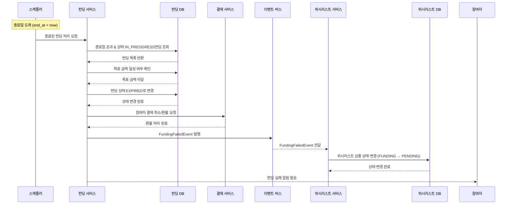

# 4.4 펀딩 종료일 초과 처리 - Sequence Diagram

## Diagram

## 주요 흐름

1. 스케줄러가 종료일 도래한 펀딩 탐지
2. 종료일 초과 & IN_PROGRESS 상태 펀딩 조회
3. 목표 금액 달성 여부 확인 (미달)
4. 펀딩 상태를 EXPIRED로 변경
5. 참여자 결제 취소/환불 처리
6. FundingFailedEvent 이벤트 발행
7. 위시리스트 상품 상태를 PENDING으로 복원
8. 참여자에게 펀딩 실패 알림 발송

## 핵심 포인트
- **배치 처리**: 스케줄러 기반 자동 만료 처리
- **자동 환불**: 실패 시 참여자 결제 자동 환불
- **상태 복원**: 위시리스트 상품을 PENDING 상태로 되돌림
- **알림 전송**: 모든 참여자에게 실패 알림

## 관련 문서
- [User Story & Acceptance Criteria](../user-stories/4.4-funding-expiration.md)
- [메인 기획서](../requirements/260112-PRD-giftify-requirements.md#44-펀딩-종료일-초과-처리-funding-expiration)
