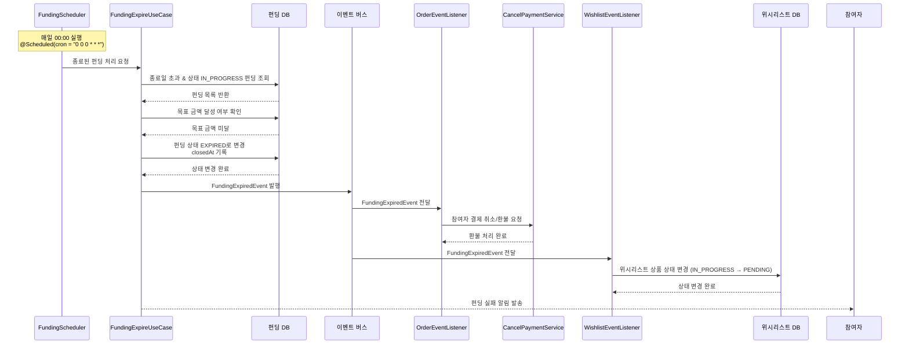

# 4.4 펀딩 종료일 초과 처리 - Sequence Diagram

## Diagram

## 주요 흐름

1. FundingScheduler가 매일 00:00에 자동 실행 (@Scheduled)
2. 종료일 초과 & IN_PROGRESS 상태 펀딩 조회
3. 목표 금액 달성 여부 확인 (미달)
4. 펀딩 상태를 EXPIRED로 변경, closedAt 기록
5. FundingExpiredEvent 이벤트 발행
6. OrderEventListener가 환불 처리 (CancelPaymentService)
7. WishlistEventListener가 위시리스트 상품 상태를 PENDING으로 복원
8. 참여자에게 펀딩 실패 알림 발송

## 핵심 포인트
- **배치 처리**: 매일 00:00 스케줄러 기반 자동 만료 처리
- **이벤트 기반 환불**: FundingExpiredEvent → OrderEventListener → CancelPaymentService
- **상태 복원**: 위시리스트 상품을 PENDING 상태로 되돌림 (IN_PROGRESS → PENDING)
- **알림 전송**: 모든 참여자에게 실패 알림

## 관련 문서
- [User Story & Acceptance Criteria](../user-stories/4.4-funding-expiration.md)
- [메인 기획서](../requirements/260112-PRD-giftify-requirements.md#44-펀딩-종료일-초과-처리-funding-expiration)
