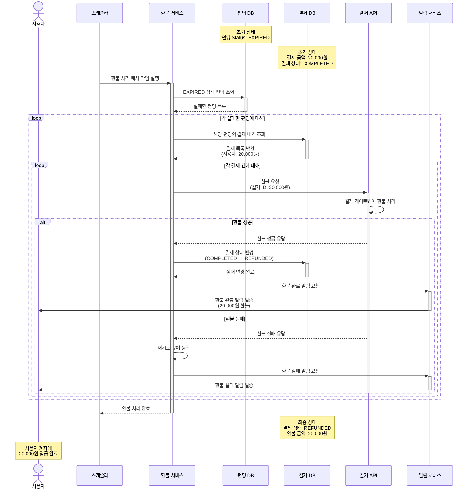

# 4.5 결제 취소 및 환불 - Sequence Diagram

## Diagram

## 주요 흐름

1. 스케줄러가 환불 처리 배치 작업 실행
2. EXPIRED 상태 펀딩 조회
3. 각 실패한 펀딩의 결제 내역 조회
4. 각 결제 건에 대해 환불 요청
5. 결제 게이트웨이를 통한 환불 처리
6. 환불 성공 시: 결제 상태를 REFUNDED로 변경하고 알림 발송
7. 환불 실패 시: 재시도 큐에 등록하고 실패 알림 발송
8. 환불 처리 완료

## 핵심 포인트
- **자동 환불**: 펀딩 실패 시 배치 작업을 통한 자동 환불
- **재시도 메커니즘**: 환불 실패 시 재시도 큐 활용
- **상태 관리**: 결제 상태를 REFUNDED로 명확히 변경
- **알림**: 성공/실패 모두 사용자에게 알림 발송

## 관련 문서
- [User Story & Acceptance Criteria](../user-stories/4.5-refund.md)
- [메인 기획서](../requirements/260112-PRD-giftify-requirements.md#45-결제-취소-및-환불-refund)
