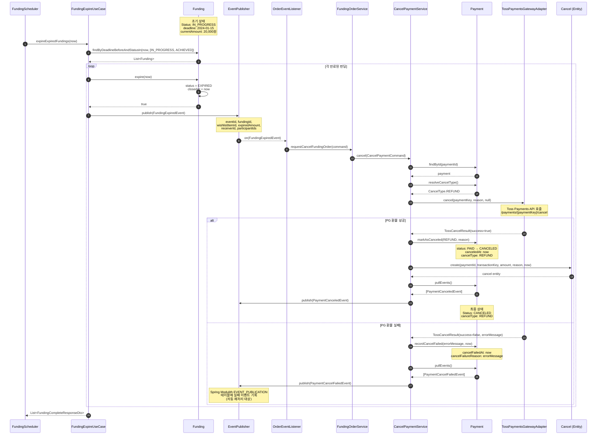

# 4.5 결제 취소 및 환불 - Sequence Diagram

## Diagram

## 주요 흐름

1. FundingScheduler가 주기적으로 만료된 펀딩 조회
2. FundingExpireUseCase가 deadline이 지난 IN_PROGRESS 또는 ACHIEVED 상태의 펀딩을 조회
3. 각 펀딩의 expire() 메서드를 호출하여 상태를 EXPIRED로 변경
4. FundingExpiredEvent 발행
5. OrderEventListener가 이벤트를 수신하여 FundingOrderService.requestCancelFundingOrder() 호출
6. CancelPaymentService가 결제 취소 처리
7. TossPaymentsGatewayAdapter를 통해 PG 취소 API 호출
8. 환불 성공 시: Payment 상태를 CANCELED로 변경하고 PaymentCanceledEvent 발행
9. 환불 실패 시: PaymentCancelFailedEvent 발행 (Spring Modulith EVENT_PUBLICATION 테이블에 기록)

## 펀딩 거절 시나리오

펀딩이 달성(ACHIEVED)되었으나 수령자가 거절하는 경우:

1. FundingRefuseUseCase.refuseFunding() 호출
2. Funding.refuse() → status를 REFUSED로 변경
3. FundingCanceledEvent 발행
4. OrderEventListener가 이벤트를 수신하여 동일한 환불 플로우 진행

## 핵심 포인트

- **RefundService는 존재하지 않음**: 환불은 CancelPaymentService를 통해 처리
- **PaymentStatus.REFUNDED는 존재하지 않음**: CANCELED 상태를 사용 (cancelType으로 구분)
- **재시도 큐는 별도로 존재하지 않음**: Spring Modulith의 EVENT_PUBLICATION 테이블이 실패한 이벤트를 자동으로 재처리
- **이벤트 기반 환불**: 펀딩 만료(FundingExpiredEvent) 또는 거절(FundingCanceledEvent) 시 자동으로 환불 처리
- **멱등성 보장**: FundingExpiredEvent는 @ApplicationModuleListener를 통해 트랜잭션 커밋 후 비동기 처리

## 상태 전이

### FundingStatus
- IN_PROGRESS / ACHIEVED → EXPIRED (만료)
- ACHIEVED → REFUSED (거절)

### PaymentStatus
- PAID → CANCELED (환불 성공)
- PAID → PAID (환불 실패, cancelFailedAt 기록)

### CancelType
- REFUND: PG 환불 처리
- CANCEL: PG 환불 없이 취소 (결제 전 취소)

## 관련 문서
- [User Story & Acceptance Criteria](../user-stories/4.5-refund.md)
- [메인 기획서](../requirements/260112-PRD-giftify-requirements.md#45-결제-취소-및-환불-refund)
