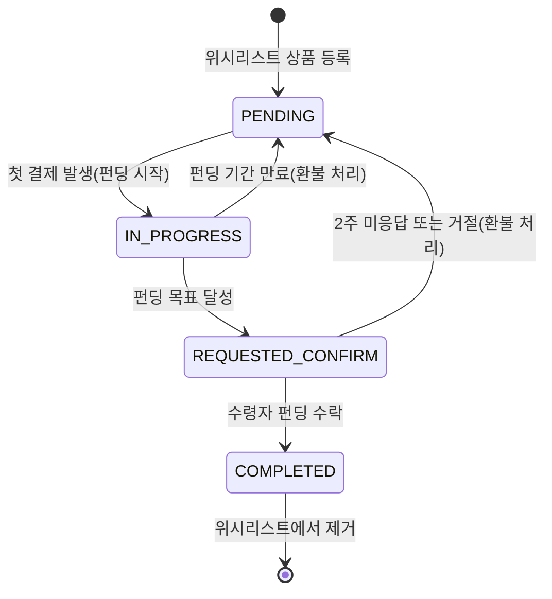

# 4.6 위시리스트 상품 상태 관리 - Sequence Diagram

## Diagram

## 주요 흐름

### 1. PENDING → IN_PROGRESS
- 트리거: 첫 결제 발생
- 액션: 펀딩 객체 생성

### 2. IN_PROGRESS → REQUESTED_CONFIRM
- 트리거: 펀딩 목표 금액 달성
- 액션: 수령자 확인 대기 상태로 전환

### 3. IN_PROGRESS → PENDING
- 트리거: 펀딩 기간 만료
- 액션: 펀딩 EXPIRED 처리 및 환불

### 4. REQUESTED_CONFIRM → COMPLETED
- 트리거: 수령자가 펀딩 수락
- 액션: 위시리스트에서 상품 제거, 주문 처리

### 5. REQUESTED_CONFIRM → PENDING
- 트리거: 2주 미응답 또는 수령자 거절
- 액션: 펀딩 CLOSED 처리 및 환불

## 핵심 포인트
- **상태 동기화**: 펀딩 상태와 위시리스트 상품 상태 동기화
- **확인 프로세스**: 펀딩 완료 후 수령자 확인 단계 필수
- **자동 복원**: 미응답 시 자동으로 PENDING 상태로 복원
- **환불 처리**: 실패/거절 시 자동 환불

## 관련 문서
- [User Story & Acceptance Criteria](../user-stories/4.6-wishlist-state-management.md)
- [메인 기획서](../requirements/260112-PRD-giftify-requirements.md#46-위시리스트-상품-상태-관리-wishlist-state)
