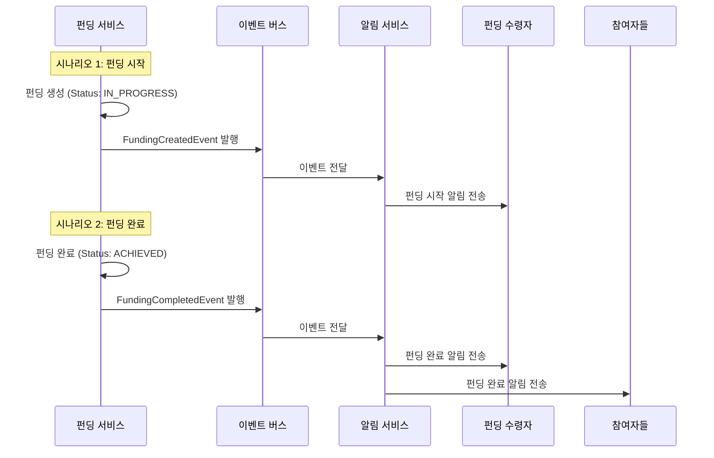

# 4.7 펀딩 참여 알림 - Sequence Diagram

## Diagram

## 주요 흐름

### 시나리오 1: 펀딩 시작 알림
1. 첫 결제 발생으로 펀딩 생성 (IN_PROGRESS)
2. FundingCreatedEvent 이벤트 발행
3. 알림 서비스가 이벤트 수신
4. 펀딩 수령자에게 알림 전송

### 시나리오 2: 펀딩 완료 알림
1. 목표 금액 달성으로 펀딩 완료 (ACHIEVED)
2. FundingCompletedEvent 이벤트 발행
3. 알림 서비스가 이벤트 수신
4. 수령자 및 모든 참여자에게 알림 전송

## 핵심 포인트
- **이벤트 기반**: 이벤트 버스를 통한 느슨한 결합
- **다중 알림**: 펀딩 완료 시 수령자와 참여자 모두에게 알림
- **실시간성**: 이벤트 발생 즉시 알림 전송
- **알림 채널**: 이메일/카카오 등 내부 정책에 따른 채널 활용

## 관련 문서
- [User Story & Acceptance Criteria](../user-stories/4.7-funding-notification.md)
- [메인 기획서](../requirements/260112-PRD-giftify-requirements.md#47-펀딩-참여-알림-notification)
