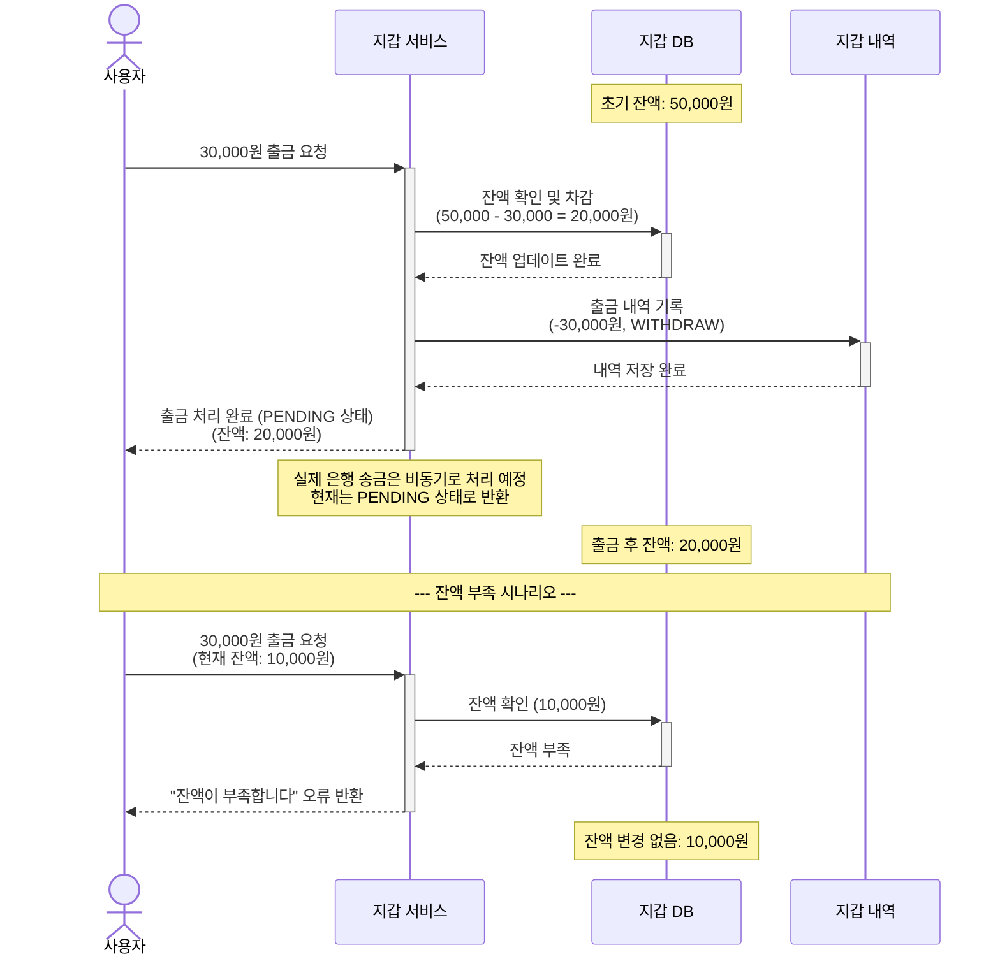

# 4.9 예치금 출금 완료 - Sequence Diagram

## Diagram

## 주요 흐름

### 성공 시나리오
1. 사용자가 30,000원 출금 요청
2. 잔액 확인 (50,000원 - 충분함)
3. 지갑 잔액 즉시 차감 (50,000 - 30,000 = 20,000원)
4. 출금 내역 기록 (WalletHistory에 WITHDRAW 트랜잭션 저장)
5. 출금 처리 완료 응답 (PENDING 상태)
6. 실제 은행 송금은 비동기로 처리 예정 (미구현)

### 잔액 부족 시나리오
1. 사용자가 30,000원 출금 요청 (현재 잔액: 10,000원)
2. 잔액 확인 (10,000원 - 부족함)
3. "잔액이 부족합니다" 오류 반환
4. 잔액 변경 없음

## 핵심 포인트
- **상태 관리**: PENDING, COMPLETED, FAILED (현재는 PENDING만 사용)
- **즉시 차감**: 출금 요청 시 잔액 즉시 차감
- **비동기 처리**: 실제 은행 송금은 비동기로 처리 예정 (미구현)
- **검증**: 출금 전 잔액 충분 여부 검증 (Wallet 도메인에서 처리)
- **이력 관리**: WalletHistory에 WITHDRAW 트랜잭션 기록
- **별도 테이블 없음**: withdrawal_requests 테이블 없음, WalletHistory만 사용

## 관련 문서
- [User Story & Acceptance Criteria](../user-stories/4.9-wallet-withdrawal.md)
- [메인 기획서](../requirements/260112-PRD-giftify-requirements.md#49-예치금-출금-완료)
