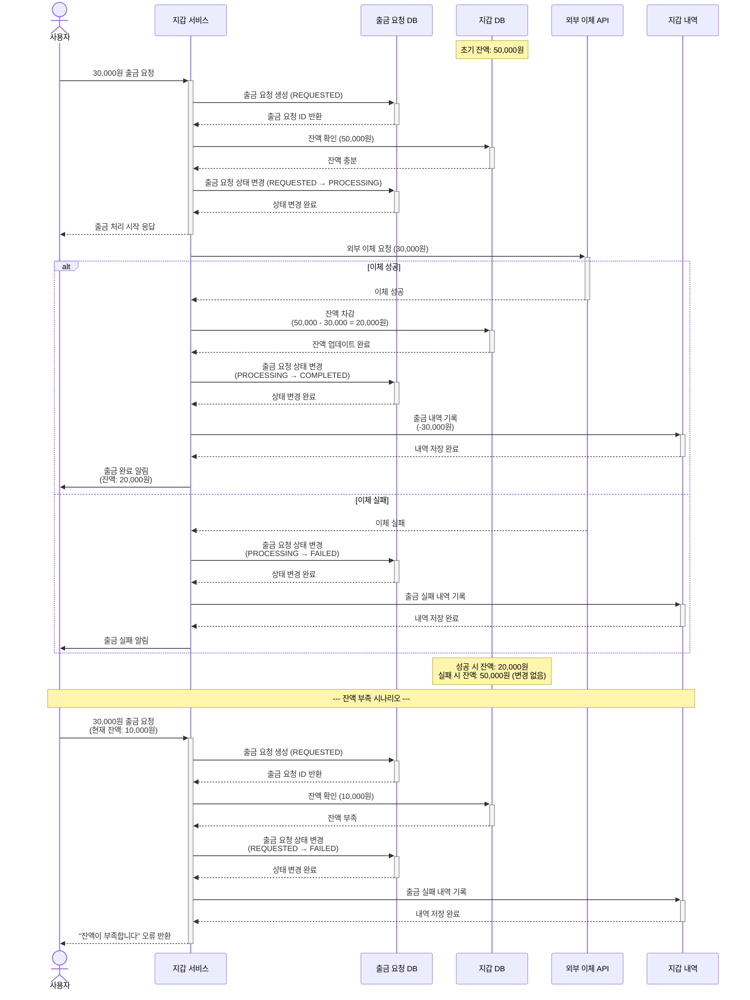

# 4.9 예치금 출금 완료 - Sequence Diagram

## Diagram

## 주요 흐름

### 성공 시나리오
1. 사용자가 30,000원 출금 요청
2. 출금 요청 생성 (REQUESTED)
3. 잔액 확인 (50,000원 - 충분함)
4. 출금 요청 상태를 PROCESSING으로 변경
5. 외부 이체 API 호출
6. 이체 성공
7. 지갑 잔액 차감 (50,000 - 30,000 = 20,000원)
8. 출금 요청 상태를 COMPLETED로 변경
9. 출금 내역 기록
10. 출금 완료 알림

### 이체 실패 시나리오
1. 외부 이체 실패
2. 출금 요청 상태를 FAILED로 변경
3. 출금 실패 내역 기록
4. 잔액은 변경되지 않음
5. 출금 실패 알림

### 잔액 부족 시나리오
1. 사용자가 30,000원 출금 요청 (현재 잔액: 10,000원)
2. 출금 요청 생성 (REQUESTED)
3. 잔액 확인 (10,000원 - 부족함)
4. 출금 요청 상태를 FAILED로 변경
5. 출금 실패 내역 기록
6. "잔액이 부족합니다" 오류 반환

## 핵심 포인트
- **상태 관리**: REQUESTED → PROCESSING → COMPLETED/FAILED 상태 전이
- **비동기 처리**: 외부 이체는 비동기로 처리
- **트랜잭션**: 이체 성공 시에만 잔액 차감
- **검증**: 출금 전 잔액 충분 여부 검증
- **이력 관리**: 모든 출금 시도 내역 기록

## 관련 문서
- [User Story & Acceptance Criteria](../user-stories/4.9-wallet-withdrawal.md)
- [메인 기획서](../requirements/260112-PRD-giftify-requirements.md#49-예치금-출금-완료)
